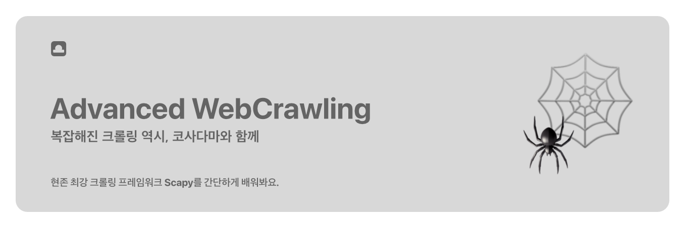

※ 본 교안은 노션(notion)에서 작성되었습니다. 마크다운 파일로 변환하면서 빠진 파일들이 있습니다.

완전한 내용의 교안은 아래 링크에서 확인해주세요 :)

- [노션 링크](https://cosadama.notion.site/2021-Advanced-WebCrawling-50294bf265b842dab393c9e2077ced45)

 

# 2021 Advanced WebCrawling - 코사다마 스터디 가이드

코사다마의 웹크롤링 심화 스터디에 참여하신 모든 분들을 환영합니다 🙌

 

## 스터디 목표

웹크롤링 심화 과정은 작년 커리큘럼 수요조사에서 가장 높은 투표수를 얻어 개설되었습니다. 심화 과정인 만큼 기존 데이터 사이언스 입문에서 배웠던 BeautifulSoup나 Selenium보다 훨~씬 복잡한, **Scrapy**라는 새로운 크롤링 프레임워크를 다루려고 합니다.

Scrapy는 빠른 크롤링 속도와 넓은 확장성, 뛰어난 데이터 처리와 저장 능력을 가지고 있습니다. 이러한 장점 덕분에 이미 해외에서는 자주 쓰이고 있는 고급 기법이죠 ✨

Scrapy는 **터미널 환경**에서 크롤링이 이루어지기 때문에 처음 배우는 입장에서는 상당히 어려울 수 있습니다. 그래서 이번 커리큘럼에서는 Scrapy의 모든 부분을 다루기 보다는, **기본적인 사용법을 익히는 것을 목표**로 합니다. 

 

## 스터디 진행환경

Scrapy는 **터미널 환경**에서 작업합니다. 아래 영상은 본 커리큘럼을 이해하는 데 도움이 되니 시청 바랍니다.

- [디렉터와 터미널 - 개발자가 반든시 알아야 할 기본소양](https://www.youtube.com/watch?v=6z7FVYXnk3E&feature=youtu.be)

 

## 스터디 진행방식

- **매주 토요일** **슬랙 announcement 채널**에 교안이 업로드 됩니다.
- 교안이 업로드 되면 그 교안으로 일주일 동안 스스로 공부합니다.
- 모르는 질문은 언제든 **슬랙 #2021_qna 채널**에 질문 해주시면 됩니다.
- **매주 토요일 오후 2시**까지 해당 주차의 과제를 업로드 해주시면 됩니다.

 

## 스터디 유의사항

- 커리큘럼은 다음 자료를 참고하여 만들어졌습니다.
    1. 잔재미코딩, **『현존 최강 크롤링 기술: Scrapy와 Selenium 정복』**, (온라인강의, ****인프런)
    2. 카토 코타, **『파이썬을 이용한 웹 크롤링과 스크레이핑』**, 위키북스(2018), 80-83, 131-133, 267-320
    3. 라이언 미첼, **『파이썬으로 웹 크롤러 만들기(2판)』**, 한빛미디어(2019), 95-114
    
    책은 구매하실 필요 없습니다. 다만 웹크롤링에 대한 책을 하나 구비하고 싶다면 *카토 코타의 '파이썬을 이용한 웹 크롤링과 스크레이핑(위키북스)'*를 추천드립니다.
    
- 과제 미제출 시 아웃카운트 1점, 지각제출은 0.5점이 적립됩니다. 아웃카운트가 총 3점이 적립된 경우 **더 이상 스터디에 참여할 수 없습니다.** 스터디의 원활한 진행을 위해 부득이하게 운영진들이 내린 결정이니 이해해 주시면 감사하겠습니다. 열심히 교안을 만든 운영진을 봐서라도 성실한 과제 수행 부탁해요,,, 🙃

 

## 과제 제출 방식

- 과제 제출 시 **슬랙 assignment 채널**에 아래와 같은 제목으로 과제 파일을 올려주시면 됩니다. 다른 스터디와 구분을 짓기 위함이니 해주시면 이렇게 해주시면 감사하겠습니다.
  
    - 🕸️ [scrapy]고다람_X주차 과제
- 과제 제출 후, **아래 링크에 접속하여 본인의 이름 옆에 O 표시**를 해주시면 됩니다. 까먹지 마세요😽 본인이 과제를 제대로 했을 시에 운영진이 해당 칸에 노란색으로 이쁘게 칠해 드립니다.

 

## 커리큘럼 목차

| 주차  | 학습 내용                                                    |
| :---: | ------------------------------------------------------------ |
| **1** | **1. Scrapy 소개**     1-1. Scrapy란?         1-2. Scrapy는 객체 지향 프로그래밍이다!     1-3. Scrapy 설치하기 **2. Scrapy shell**     2-1. Scrapy shell이란?     2-2. Scrapy shell에서 CSS Selector와 XPath로 데이터 가져오기 **3. Scrapy 프로젝트 생성** |
| **2** | **1. Spider(크롤러) 만들기**     1-1. Spider 클래스     1-2. Robots.txt(로봇 배제 표준) **2. 크롤링 데이터 다루기**     2-1. Item 만들기     2-2. Spider 수정하기     2-3. 데이터 저장하기     2-4. 데이터 후처리하기 |
| **3** | **1. 준비**     1-1. 프로젝트, Spider(=크롤러) 만들기     1-2. Item 만들기     1-3. Request 메서드, callback과 meta 파라미터 **2. 실습**     2-1. 메인 카테고리의 베스트 상품 크롤링     2-2. 메인 카테고리, 서브 카테고리의 베스트 상품 크롤링     2-3. 데이터 후처리 및 저장 |
| **4** | **1. 실습 환경 준비**     1-1. VS Code 설치하기     1-2. VS Code 사용 팁 ⭐     1-3. VS Code에서 작업하기 **2. Scrapy LOG_LEVEL** |

 

- ***9월 4일 -:** 웹크롤링 심화 스터디 시작*
- ***10월 3일 - 10월 30일***: 중간고사 2주 전부터 중간고사 기간까지 휴강입니다.
- 커리큘럼 일정은 스터디 진행 과정에서 변동될 수 있습니다.

 