# [Advanced WebCrawling] WEEK1

>  작성자: 송혜민, 신윤진

※ 본 교안은 노션(notion)에서 작성되었습니다. 마크다운 파일은 가독성이 다소 떨어지며 빠진 파일들이 있습니다.

완전한 내용의 교안은 아래 링크에서 확인해주세요 :)

- [노션 링크](https://www.notion.so/cosadama/Advanced-WebCrawling-WEEK1-903c0c6c93c340a6b63a9ff608b9b1cf)


안녕하세요 여러분 😊

기존에 여러분이 DS 커리에서 BeautifulSoup과 Selenium으로 웹크롤링을 경험해보셨다면, 이번에는 Scrapy를 통해 조금 더 심화된 혹은 또다른 방식의 웹크롤링을 소개해드리고자 합니다.

우선, 이번 첫 주차에는 Scrapy에 관해 본격적으로 학습하기 앞서 Scrapy가 무엇인지, 어떤 방식의 프로그래밍인지 알아본 후 Scrapy에서 CSS Selector와 XPath를 통해 데이터를 가져오는 방법, 그리고 Scrapy 실습을 위한 환경 설치까지 다뤄보겠습니다!

<br>

##### 📢 **공지사항**


---

Scrapy 실습은 터미널 환경에서 이루어집니다. 터미널을 처음 사용해보는 분들은 익숙해지기까지 오래 걸리실 수 있어요. 방대한 출력 메세지에 오류를 찾는 것이 매우 힘들게 느껴질 수도 있습니다 😂

하지만 출력되는 양에 겁먹지 않고 한줄한줄 뜯어보면 오류 메세지(DEBUG, ERROR 등)를 찾아낼 수 있습니다. 다른 건 몰라도 오류 메세지는 눈에 딱 띄거든요. (무슨 말인지 곧 알게되실 거예요.)

덧붙여 저희 실습수준에서 발생하는 오류는 대부분 쉽게 해결이 가능합니다. 데이터 분석에 있어 오류 해결 능력 또한 중요한 역량이기 때문에, 이제는 스스로 오류를 해결하는 연습을 해보셨으면 좋겠습니다. 일취월장한 구글링 + 영어실력과 더불어 성취감을 얻으실 수 있을거예요 😉

혼자 해봤는데도 모르겠다면? 망설이지 말고 언제든 슬랙에 질문해주세요 😁

<br>

## 1. Scrapy 소개

### 1-1. Scrapy란?

---

Scrapy는 대표적인 크롤링 프레임워크 중 하나입니다. 프레임워크란 함수와 코드를 미리 작성해놓음으로써, 특정 함수를 특정 위치에 어떻게 사용하고 작성해야 하는지를 정해놓은 프로그램입니다. 대표적으로는 Python, C, C++, JAVA가 이에 해당합니다.

##### 💡 **개념잡기: 프레임워크**란 무엇일까?


---

- 영상 보기: [라이브러리? 프레임워크? 차이점 아직도 모름? 5분 순삭.](https://youtu.be/t9ccIykXTCM)

영상의 내용이 완전히 이해되지 않아도 흐름을 이해해보세요. 코사다마에서 배웠던 내용을 예시로 들어보면 다음과 같습니다.

- 라이브러리: Beautifulsoup, Selenium
- 프레임워크: Scrapy

(selenium의 경우 라이브러리인지, 프레임워크인지 의견이 갈린다고 합니다.)

<br>

Scrapy는 Selenium, BeautifulSoup에 비해 다양한 기능을 가지고 있고, 크롤링을 좀 더 안정적이고 빠르게 할 수 있다는 장점을 지니고 있습니다.

##### 📖 **참고하기: Scrapy vs. Selenium vs. Beautifulsoup**


---

각각의 장단점이 궁금한 분들은 아래 글을 참고해보세요 😉

- [Python 웹 크롤러 도구 비교 및 사용 후기(Scrapy vs selenium vs Requests, urllib)](https://keyhyuk-kim.medium.com/python-%EC%9B%B9-%ED%81%AC%EB%A1%A4%EB%9F%AC-%EB%8F%84%EA%B5%AC-%EB%B9%84%EA%B5%90-%EB%B0%8F-%EC%82%AC%EC%9A%A9-%ED%9B%84%EA%B8%B0-scrapy-vs-selenium-vs-requests-urllib-6483041ca1ba)

<br>

Scrapy를 통한 크롤링은

1. 크롤링에 사용할 스파이더(Spider: Scrapy 기반 크롤링 프로그램) 생성
2. 크롤링할 사이트(시작점)와 크롤링할 아이템(Item)에 대한 경로 설정
3. 크롤링 실행 및 데이터 추출

의 방식으로 이루어지게 됩니다. 자세한 내용은 2주차에서 자세히 다뤄보겠습니다.

<br>

### 1-2. Scrapy는 객체 지향 프로그래밍이다!

---

Scrapy는 객체 지향 프로그래밍입니다. 객체 지향 프로그래밍이 무엇인지 알아보기 전에 우선 아래 자료를 **반드시 복습**해주세요. 

- [파기문 6주차](https://www.notion.so/2021-PYTHON-BASIC-GRAMMAR-WEEK6-80843dca0b5b4032a5025c03fe9fdb41)
- [[점프 투 파이썬] 05-1 클래스](https://wikidocs.net/28)

<br>

클래스와 객체, 상속에 대해 복습하셨다면 다음 자료를 학습해주세요.

(어려운 내용이기 때문에 완전히 이해되지 않는게 정상입니다. '아, 이런거구나~' 정도의 느낌만 가져가보세요!)

- [파이썬 문법 9 - 클래스(class) 만들기](https://offbyone.tistory.com/126)

<br>

정리하면 다음과 같습니다.

1. **클래스 선언**
   특정 사물을 나타낼 수 있는 설계도를 만든다. 
   (attribute : 특정 사물(객체)의 변수, method : 특정 사물(객체)의 함수)
   
    ```python
    # class 선언 형태
    class 클래스이름 : 
    	attribute 선언(예: attribute1 = 0) 
    	
    	method 선언(def 메서드(self,,,)와 같은 방식으로 선언)
    ```
   
2. **객체(object) 생성**
   해당 사물의 설계도를 기반으로 '사물1'이라는 객체를 만든다. 하나의 클래스에 여러 개의 객체(사물1, 사물2,,,)가 존재 가능하며, 각 객체들은 별도로 동작할 수 있다.
   
    (예: 사물1 = 클래스이름(), 사물2 = 클래스이름())
   
3. **객체 속성 호출**
   
    '사물1' 객체의 속성을 호출한다. 
    
    (예: 사물1.attribute1)

<br>

이해하기 쉽게 예시를 들어 설명해보겠습니다.

사각형이라는 도형을 만든다고 합시다. 사각형을 만드는 과정에서 **클래스 선언**은 우리가 만들 사각형의 설계도, 즉 사각형의 가로 · 세로 길이, 색깔, 이름 등을 정해주는 일종의 틀을 만드는 것입니다.
이 설계도를 바탕으로 실제 사각형을 만드는 것이 바로 **객체 생성**이에요. 만들 수 있는 사각형의 개수는 무한개이기 때문에, 하나의 클래스(설계도)에 여러 개의 객체(사각형)이 존재할 수 있는 것입니다. 
마지막으로  **객체 속성을 호출**하는 것은 클래스 선언에서 우리가 설정한 사각형의 가로 · 세로 길이, 색깔, 이름을 불러내는 것을 말합니다.

```python
# 사각형 만들기

# 클래스 선언
class Square() : 
        height = 2    # attribute 선언
        width = 3
        color = 'orange'
        name = 'square'
        
        def square_name(self) :   # method 선언
                return self.name

#객체 생성
square1 = Square()

#객체 속성 호출
square1.color
> 출력값: 'orange'

square1.name = 'orange square'    # 호출 후 수정 가능
square1.name
> 출력값: 'orange square'
```

<br>

위와 같은 개념을 바탕으로, 객체들 간의 유기적 상호작용으로 이루어지는 프로그래밍을 객체 지향 프로그래밍이라고 해요. 저희가 공부할 Scrapy 역시 객체 지향 프로그래밍이니 관련 개념과 친해지시길 바랍니다.

<br>

### 1-3. Scrapy 설치하기

---

Scrapy는 비교적 크기가 크고 복잡하기 때문에 pip 명령어로 설치한 뒤 버전 충돌, 의존 문제 등 해결하기 어려운 문제에 빠지는 경우가 많습니다. (저희 수준에서는 별 문제가 없긴해요 🤣)

그래서 Scrapy 설치는 **가상환경 사용이 추천**됩니다. 본인 컴퓨터에 직접 설치해도 되지만! 우리는 아나콘다(anaconda)를 사용할거예요. 아직 설치하지 않으셨다면 다음 글을 참고해 주세요.

##### 💡 **개념잡기: 아나콘다(anaconda)란?**


---

아나콘다(anaconda)란, 세계적으로 많이 쓰이는 데이터 사이언스 분야의 파이썬 / R / JAVA 등의 프로그래밍 언어 패키지 소프트웨어로, 프로그래밍 언어들의 의존성 및 버전 등의 문제 발생을 줄이도록 설계되어 있으며, 전용 가상환경을 제공합니다.

- [[파이썬 코딩 도장] 아나콘다 설치하기](https://dojang.io/mod/page/view.php?id=2456)
  
    기존에 따로 **파이썬을 설치하신 적이 있다면**, 해당 글의 **'[그림 46-7] 아나콘다의 경로를 환경 변수의 PATH에 추가할지 설정하는 화면'을 주의깊게** 읽어주세요. 환경 변수 설정을 잘못하면 jupyter notebook 사용에 문제가 생깁니다 😢
    

##### 📖 **참고하기: 가상환경이란?**


---

가상환경이 무엇인지 궁금한 분들은 아래 글을 참고해보세요. '아, 이런거구나~' 정도의 느낌만 가져가시면 됩니다.

- [파이썬 코딩 도장](https://dojang.io/mod/page/view.php?id=2470)

<br>

Scrapy는 터미널 환경에서 작업해야 합니다.

- **1 - Window 사용자**
  
    아나콘다 설치가 완료됐다면 `Anaconda Powershell Prompt`를 실행해주세요.
    
    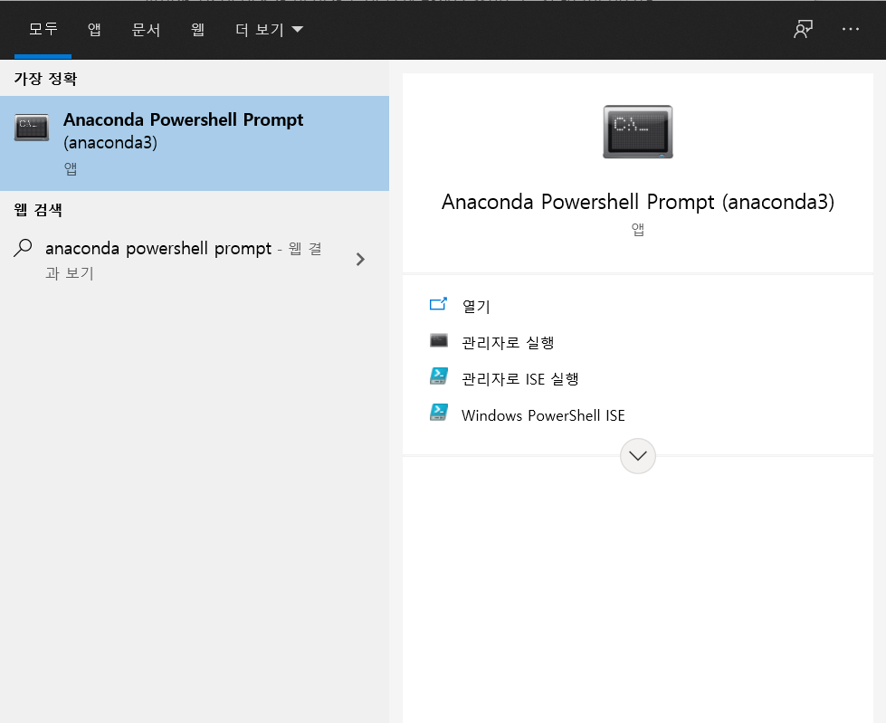
    
    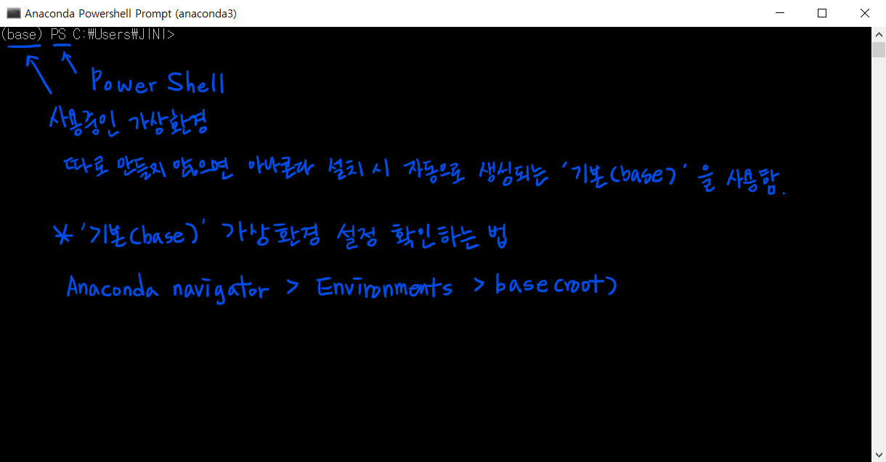
    
    <br>
    
    (추천하지 않음) jupyter notebook을 실행한 뒤, Terminal을 실행해도 됩니다.
    
    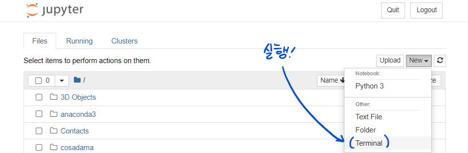
    
    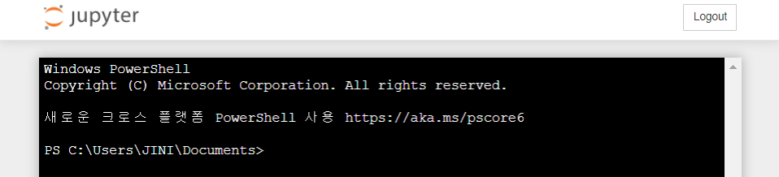

<br>

- **2 - 1 - Mac 사용자 - conda base 가상환경 (by. 김윤진님 ❣️)**

    아나콘다 설치가 완료됐다면 `터미널 프로그램`을(Terminal, iTerm2 등) 실행해주세요.

    **conda activate base**를 입력해 아나콘다 가상환경을 활성화합니다. (base)가 뜨면 성공이에요.

    (아나콘다 가상환경을 비활성화하려면 **conda deactivate base**를 하면 됩니다.)

    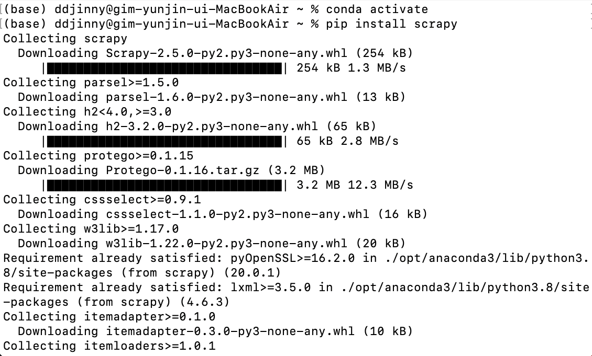

    ##### 📖 **참고하기: Mac 아나콘다 가상환경 생성/삭제/activate/deactivate**


    ---
    
    macOS 사용자분들은 아래 글의 3. 가상환경 활성화(activate) 부분을 참고해보세요 🤔
    
    - [맥북 아나콘다 가상환경 생성/삭제/activate/deactivate](https://joytk.tistory.com/14)

<br>

- **2 - 2 - Mac 사용자 - pipenv 가상환경 (conda base가 작동하지 않을 경우)**
    - [Scrapy Setup For Mac](https://www.notion.so/Scrapy-Setup-For-Mac-f316ab43609443b290667e8fe2fd6f5b)

<br>

<br>

터미널에 **pip install scrapy**를 입력해 Scrapy를 설치합니다.

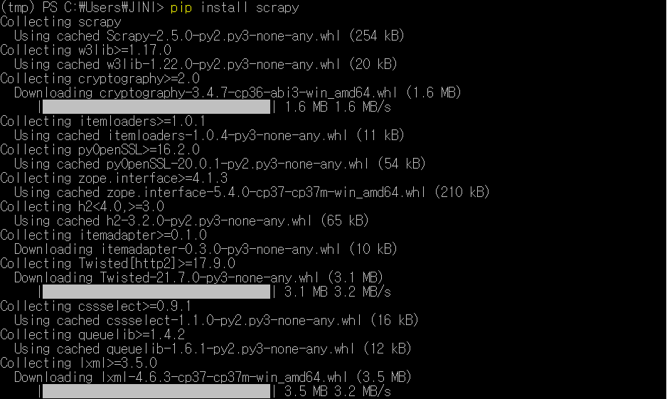

<br>

##### 📖 **참고하기:  Window vs. Mac 명령어 차이**

---

터미널에서 사용되는 명령어는 운영체제가 Window/Mac이냐에 따라 약간의 차이가 있습니다.

(명령어 차이는 Window의 명령 프롬프트(cmd)에만 해당되는 내용이며, Windows Powershell은 아래 명령어를 모두 사용할 수 있습니다.)

| 명령어                            | Window(cmd)                 | Mac                         |
| --------------------------------- | --------------------------- | --------------------------- |
| 경로 변경                         | cd(cd.. : 상위 폴더로 이동) | cd(cd.. : 상위 폴더로 이동) |
| 현재 내 경로 위치 찾기            | cd                          | pwd                         |
| 현재 디렉토리 안에 있는 파일 확인 | dir                         | ls                          |
| 터미널 화면 클리어                | cls                         | clear                       |
| Scrapy 도움말                     | scrapy / scrapy-h           | scrapy / scrapy-h           |

<br>

##### 📖 **참고의 참고하기: Mac/Window 터미널 명령어 모음**


---

명령어에 대해 더 알고싶다면 아래 글을 참고해보세요 😎

- [cmd 명령어 모음](https://m.blog.naver.com/PostView.naver?isHttpsRedirect=true&blogId=nawoo&logNo=80138979222)

<br>

## 2. Scrapy shell

### 2-1. Scrapy shell이란?

---

**Scrapy shell**은 Scrapy를 위한 인터렉티브 셸입니다. 터미널에 **scrapy shell "크롤링할 주소"**를 입력하면 해당 웹사이트의 데이터를 가져오고, 주피터 노트북과 유사한 인터페이스를 제공해줍니다.

```powershell
# 예
scrapy shell "https://news.v.daum.net/v/20210729154411508"
```

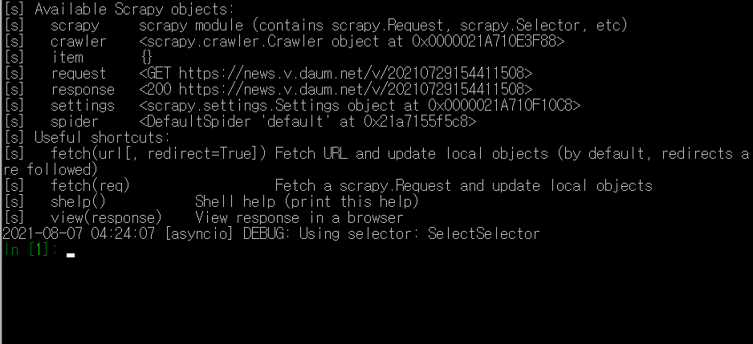

<br>

Scrapy shell 사용 시 유용한 명령어를 몇 가지 소개하겠습니다. 한 번씩 실행해보시길 바랍니다.

| 명령어         | 설명                                 |
| -------------- | ------------------------------------ |
| shelp()        | Scrapy shell 도움말                  |
| view(response) | 웹브라우저에 html 파일을 연다(open). |
| response.url   | html 주소 출력                       |
| response.text  | html 소스 출력                       |
| exit           | Scrapy shell 종료                    |

<br>

### 2-2. Scrapy shell에서 CSS Selector와 XPath로 데이터 가져오기

---

CSS Selector와 XPath를 사용해 데이터를 가져오는 법을 배워보겠습니다. 기본문법은 다음과 같습니다.

- **response.css('CSS Selector 경로')** : CSS Selector로 데이터 가져오기
- **response.xpath('XPath 경로')** : XPath로 데이터 가져오기

##### CSS Selector vs. XPath

| 설명                            | CSS Selector: response.css()    | XPath: response.xpath()    |
| ------------------------------- | ------------------------------- | -------------------------- |
| 데이터 하나만 가져오기          | ('경로').get()                  | ('경로').get()             |
| 데이터 전체를 리스트로 가져오기 | ('경로').getall()               | ('경로').getall()          |
| 태그 없이 내용(텍스트)만 추출   | 경로 뒤에 ::text 붙이기         | 경로 뒤에 /text() 붙이기   |
| 속성값(name, href 등) 추출      | 경로 뒤에 ::attr(속성값) 붙이기 | 경로 뒤에 //@속성값 붙이기 |

<br>

##### 💡 **개념잡기: 웹페이지 데이터 경로 가져오는 법**


---

1. 웹페이지에서 **ctrl+shift+c**를 누르고 원하는 데이터 클릭하면 개발자 도구(F12)에 경로 부분이 표시됩니다.

2. 그 경로에 속하는 가장 가장 가까운 div부터 내려오는 형식으로 경로를 적어 내려가면 good!
   
    a. 마우스 오른쪽 클릭 > Copy를 해도 좋지만 가끔 오류가 뜹니다.
    
    b. 예: div id 속성이 csdm scrapy인 경우
    - response.css('div#csdm.scrapy ul li a::text').getall()
    - response.xpath('//*[@id="csdm.scrapy"]/ul/li/a/text()').getall()
    
    +) **ctrl + F** : 페이지 소스에서 코드 검색 단축키
    

<br>

배운 내용을 바탕으로 다음 뉴스 기사의 제목을 크롤링해보겠습니다.

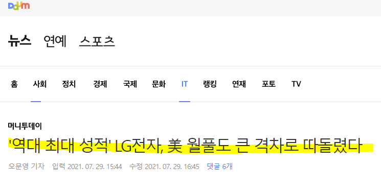

위의 기사에서 개발자 도구(F12)를 열었을 때, 기사 제목 부분에 해당하는 경로는 아래와 같이 나타납니다.

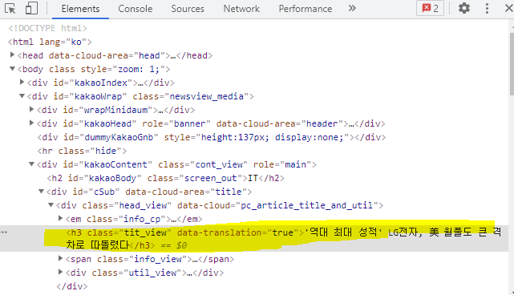

<br>

- **예제 1) CSS Selector 경로**

    다음과 같이 CSS Selector 경로를 입력해주면 기사 제목이 출력됩니다.

    ```powershell
    #기사 제목 데이터 가져오기
    response.css('#cSub > div > h3').get()    # 여기서 > 은 직계 자식 태그를 의미
    
    #기사 제목 데이터 태그 없이 텍스트만 가져오기
    response.css('#cSub > div > h3::text').get()
    # 혹은 response.css('div.head_view h3.tit_view::text').get()
    ```

    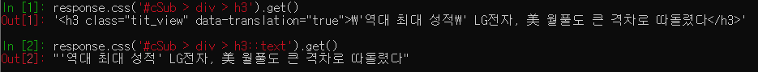

    <br>

    ##### 📖 **참고하기: CSS Selector 문법**


    ---
    
    CSS Selector 문법을 작성하는게 어렵게 느껴지면 아래 글을 참고해보세요.
    
    - [CSS Selector를 사용한 크롤링](https://www.fun-coding.org/crawl_basic4.html)
    
    <br>

- **예제 2) XPath 경로**

    다음과 같이 XPath 경로를 입력해주면 기사 제목이 출력됩니다.

    ```python
    # 기사 제목 데이터 가져오기
    response.xpath('//*[@id="cSub"]/div/h3').get()
    
    # 기사 제목 데이터 태그 없이 텍스트만 가져오기
    response.xpath('//*[@id="cSub"]/div/h3/text()').get()
    ```

    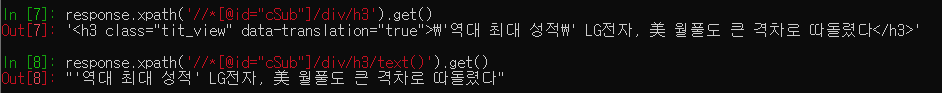

    <br>

    단, 한 가지 주의할 점!

    위의 XPath 코드를 보면 **'//*[@id="cSub"]/div/h3'** 와 같이 작은 따옴표('')가 쳐져있죠?

    XPath 안의 따옴표('')와 XPath 경로를 둘러싼 따옴표('')의 종류가 같을 경우, 아래와 같이 구문 오류가 발생하게 됩니다.

    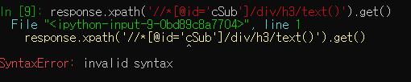

    따라서 각각을 작은따옴표(')와 큰따옴표(")로 구분해서 코드를 쳐주어야 합니다.

    <br>

    ##### 📖 **참고하기: XPath 기본 개념**


    ---
    
    - **XPath(XML Path Language)란?**
      
        XPath란 'XML 문서의 특정 요소나 속성에 접근하기 위한 경로를 지정하는 언어'를 의미합니다.
        
        (참고로 BeautifulSoup는 XPath를 통한 크롤링을 지원하지 않습니다.)
        
        - XPath 문법 맛보기: [[잔재미코딩] XPATH 이용하기](https://www.fun-coding.org/crawl_advance5.html)

<br>

하지만 XPath는 주로 과거에 사용하던 경로입니다. 그래서 이번 교안에서는 CSS Selector 경로만을 사용하여 데이터를 가져올 예정이에요. Scrapy shell을 적극 활용하여 CSS Selector를 이용한 경로가 잘 가져와졌는지 확인해보시길 바랍니다 😉

<br>

## 3. Scrapy 프로젝트 생성

설치가 완료됐으니 본격적으로 Scrapy 프로젝트를 생성해보겠습니다. 저는 다운로드 폴더에 Scrapy 폴더를 만들어 그곳에 생성했어요. 저와 동일한 위치에 만드셔도 되고, 본인이 편한 위치에 하셔도 됩니다.

- 프로젝트 생성 위치: Downloads > Scrapy
- 프로젝트 이름: st11

```powershell
#터미널
scrapy startproject 프로젝트 이름

# 프로젝트 파일을 생성할 디렉토리로 이동
# 본 교안에서 디렉토리와 폴더는 동일한 의미로 쓰임
cd Downloads\Scrapy
scrapy startproject st11    # 명령어 실행 위치: Downloads > Scrapy
```

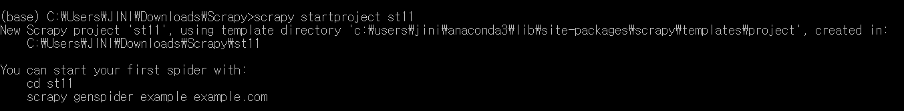

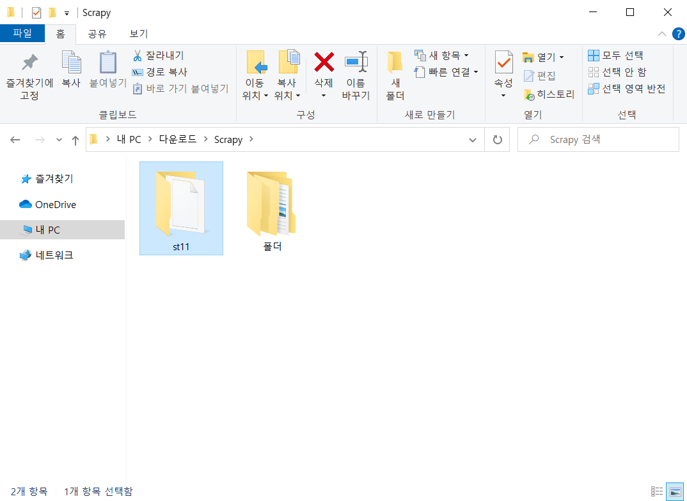

Scrapy 폴더 안에 st11 폴더가 만들어졌어요. st11 폴더 내의 디렉토리 구조를 확인하면 다음과 같습니다. (본인이 직접 폴더를 열어보거나 터미널 명령어로 확인해보세요.)

```python
scrapy.cfg
st11/                 # 프로젝트 디렉토리(★)
    __init__.py       # Scarpy 프로젝트는 파이썬 모듈
    items.py          # Item 정의 파일
    middlewares.py    # 본 교안에서는 다루지 않음
    pipelines.py      # Item Pipeline 정의 파일
    settings.py       # 프로젝트 설정 파일
    spiders/          # spider를 저장하는 디렉토리
        __init__.py
```

<br>

프로젝트 디렉토리(★)로 이동합니다. 별다른 설명이 없다면 앞으로 모든 명령어는 **프로젝트 디렉토리(scrapy.cfg가 있는 디렉토리)에서 실행**합니다.

```powershell
cd st11                             # 디렉토리 이동
Users\JINI\Downloads\Scrapy\st11    # 명령어 실행위치
```

<br>

## ** 1주차 과제

이번 주차의 과제는 2주차부터 시작될 실습을 위해 **11번가의 CSS Selector 경로**를 미리 긁어오는 것입니다.


- [11번가 사이트 베스트 카테고리 - 브랜드패션 부문](https://www.11st.co.kr/browsing/BestSeller.tmall?method=getBestSellerMain&cornerNo=1)
    - 주소: https://www.11st.co.kr/browsing/BestSeller.tmall?method=getBestSellerMain&cornerNo=1
    
    <br>
    
- **긁어와야 할 CSS Selector 경로 리스트 (5개)**
  
    1. 메인 카테고리 중 '브랜드패션' 부문 이름(글자)
    2. 브랜드패션 서브 카테고리 중 '브랜드 여성의류' 부문 이름(글자)
    3. 본인이 원하는 상품의
        1. 이름
        2. 기존가격
        3. 할인가격

<br>

5개의 CSS Selector 경로를 입력한 뒤 Scrapy shell에서 확인해보세요. CSS Selector 경로는 사람마다 작성하는 방법이 다르기 때문에 정해진 정답이 없습니다. 제대로 가져와졌다면 해당 화면을 스샷찍어서 사진파일(jpg, png 등)로 제출해주시면 됩니다.

##### 🚨 **주의사항**


---

아래와 같은 출력값이 나온다면 경로설정을 잘못한 것입니다. **Copy selecotor** 값을 입력했는데 원하는 데이터가 추출되지 않는다면 자신이 직접 경로를 작성해보세요. (id 속성 대신 class 속성을 입력하는 등) 

- '**NoneType' object has no attribute 'css**''
  
    ㄴ 이 메세지가 계속 출력되는 경우 웹페이지 주소를 제대로 입력했는지 확인해보세요.
    
- 빈 리스트([ ])

<br>

- **과제제출 방식(결과물 5개가 모두 보이도록!)**

    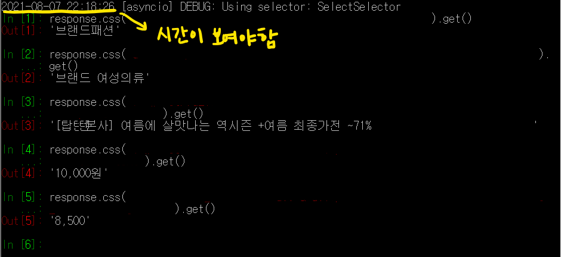


<br>

---

1주차는 앞으로 배울 Scrapy란 무엇인지 알아본 후 실습을 위한 환경 준비, 그리고 Scrapy shell과 이의 활용법을 다뤄보았습니다. 이번 주차는 비교적 기초적인 내용을 다루었기 때문에 부담이 크지 않았으리라 생각합니다 😏

다음 주부터는 본격적으로 Scrapy를 통한 크롤링 방법에 대해 학습합니다.

모두 수고하셨고 다음 주차도 열심히 공부해보아요 🔥