# [Advanced WebCrawling] WEEK2

> 작성자: 신윤진

※ 본 교안은 노션(notion)에서 작성되었습니다. 마크다운 파일은 가독성이 다소 떨어지며 빠진 파일들이 있습니다.

완전한 내용의 교안은 아래 링크에서 확인해주세요 :)

- [노션 링크](https://www.notion.so/cosadama/Advanced-WebCrawling-WEEK2-f3f44d1c18d94d1dba68166144326e53)


이번 주차에서는 11번가 사이트 크롤링을 통해 Scrapy 프로젝트 파일을 하나하나 파헤쳐 보겠습니다.

1주차에서도 언급했지만 클래스에 대한 내용 복습은 필수입니다.

클래스, 객체, 메서드 등 용어를 중심으로 복습해 주세요 🙂

- [[점프 투 파이썬] 05-1 클래스](https://wikidocs.net/28)

<br>

##### 📢 **공지사항**


---

3주차까지는 py 파일 수정을 **jupyter notebook**으로 합니다.

원래는 텍스트 에디터(코드 편집 프로그램)를 사용해야 되는데, 일단은 Scrapy 학습에 초점을 두기로 했어요. (주피터 노트북은 텍스트 에디터가 아닙니다!!!)

대표적인 텍스트 에디터로는 Visual Studio Code(VS Code), Sublime Text, Atom 등이 있습니다. 4주차에 VS Code의 기초적인 사용법을 익혀볼 예정이니 기대해 주세요 😊

- **📖 살펴보기: 텍스트 에디터 종류**
  
    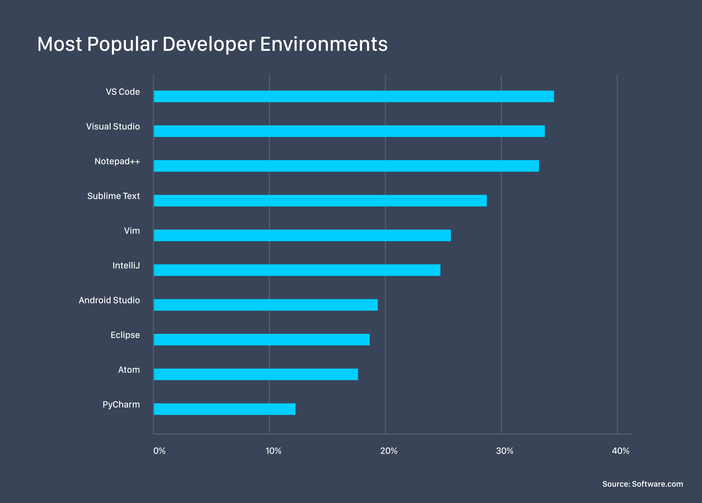
    
    - [Code Time Data: Ranking the Top 5 Code Editors in 2019 - /src/ blog](https://www.software.com/src/ranking-the-top-5-code-editors-2019)
    
    - [[코딩] 프로그래밍을 위한 텍스트 편집기 4종 추천](https://oriyong.tistory.com/64)

<br>

<br>

시작하기 앞서 jupyter notebook으로 **settings.py**를 열어 한 가지 설정을 추가하겠습니다.

- **settings.py** 여는 법을 모른다면...
    1. jupyter notebook을 실행합니다.
       
        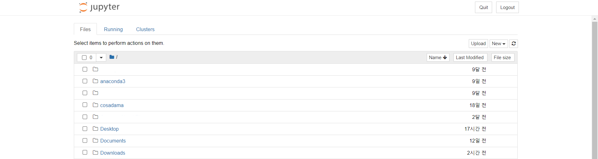
        
    2. 자신이 Scrapy 프로젝트를 만든 폴더로 이동합니다. (예: Downloads > Scrapy)
       
        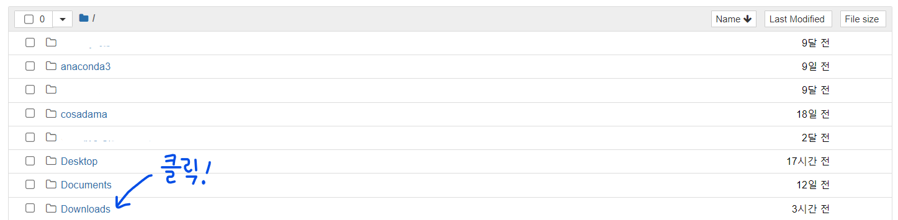
        
        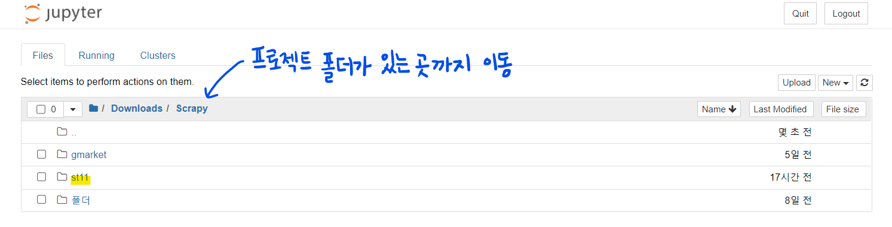
        
    3. **settings.py**를 찾아 클릭합니다.
       
        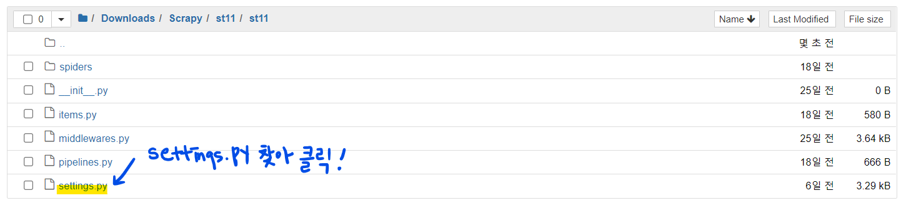
    

<br>

```python
DOWNLOAD_DELAY = 1    # 페이지 다운로드 간격을 1초로 지정
```

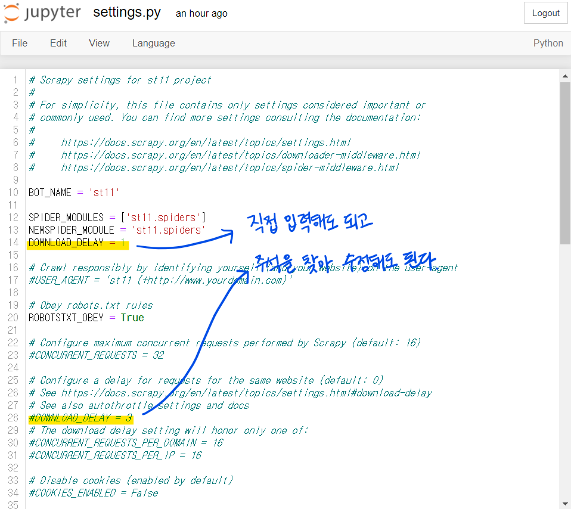

<br>

이 설정을 해주지 않으면 페이지 다운로드 간격이 0초라 웹사이트에 부하를 걸게 될 수 있습니다. 사이트 관리자의 워라밸을 위해 해당 설정을 꼭 저장해 줍시다 👨‍💻

<br>

## 1. Spider(크롤러) 만들기

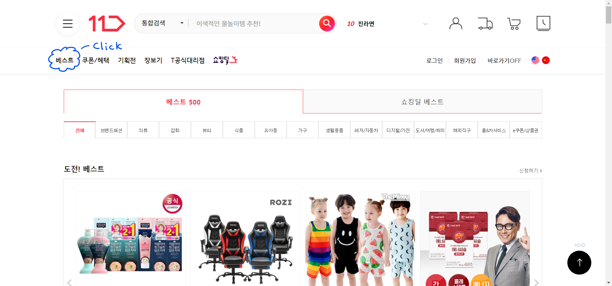

먼저 [11번가 사이트의 베스트 카테고리 - 전체 부문](https://www.11st.co.kr/browsing/BestSeller.tmall?method=getBestSellerMain&xfrom=main^gnb)를 크롤링하는 spider(=크롤러)를 만들어보겠습니다.

```powershell
#명령어 - 터미널에 입력
scrapy genspider <spider 이름> "크롤링 페이지 주소"

# 예: 11번가 베스트 카테고리 spider 생성
# 반드시 경로 이동한 뒤!!! spider 만들어 주세요!!!!!! 
cd Downloads\Scrapy\st11    # 본인의 프로젝트 디렉토리로 이동
scrapy genspider st11_all "www.11st.co.kr/browsing/BestSeller.tmall?method=getBestSellerMain"
```

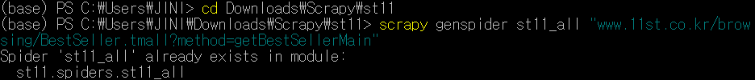

(저는 이미 만들어진 상태라 출력되는 메세지가 달라요. **'create spider '크롤러 이름' using template 'basic' in module:'** 이 출력되면 성공!)

- spider 이름: st11_all
  
    프로젝트명과 동일하게 spider 이름을 지을 수 없음.
    (Cannot create a spider with the same name as your project)
    
- 크롤링 페이지 주소: 베스트 카테고리 - 전체 부문
  
    [https://www.11st.co.kr/browsing/BestSeller.tmall?method=getBestSellerMain](https://www.11st.co.kr/browsing/BestSeller.tmall?method=getBestSellerMain)
    
    (크롤링 페이지 주소에서 https:// 는 빼줍니다. 이유는 하단에서 설명드릴게요.)

<br>

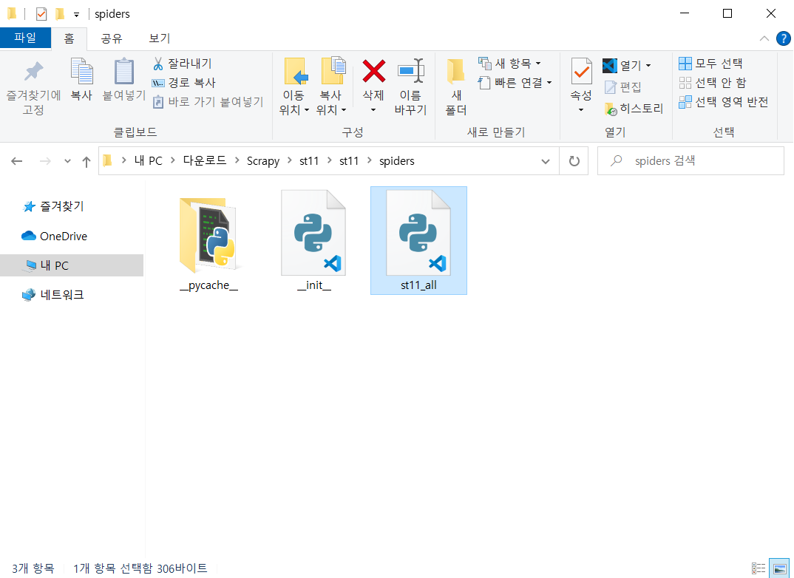

spiders 디렉토리 안에 **st11_all.py**가 생성된 것을 확인할 수 있습니다.

<br>

### 1-1. Spider 클래스

---

jupyter notebook으로 **st11_all.py**를 열어보면 다음과 같습니다.

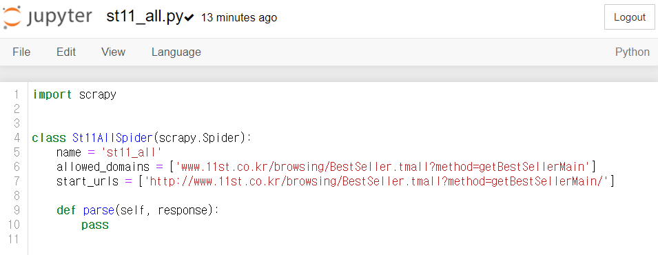

Scrapy의 spider는 **scrapy.Spider**를 상속받는 클래스입니다. 클래스 이름은 자유롭게 수정해도 되지만, 반드시 **scrapy.Spider**를 상속받아야 합니다.

클래스에 대한 내용이 기억나지 않는다면 다음 자료를 **반드시 복습**해주세요.

- [파기문 6주차](https://www.notion.so/2021-PYTHON-BASIC-GRAMMAR-WEEK6-80843dca0b5b4032a5025c03fe9fdb41)
- [[점프 투 파이썬] 05-1 클래스](https://wikidocs.net/28#_9)

<br>

**St11AllSpider 클래스**에는 3가지 속성(**name**, **allowed_domains**, **start_urls**)과 **parse() 메서드**가 있습니다.

1. **name**
   : spider의 이름을 설정하는 속성
   
    scrapy genspider 명령어를 입력했을 때 자동으로 입력된 것이며, 이후 spider 실행에 입력된 이름이 사용됩니다.
   
2. **allowed_domains**
   : 크롤링 페이지 주소의 리스트를 지정하는 속성
   
    마구잡이로 링크를 이동하다 보면 예상하지 못한 웹페이지에 접근하는 경우가 발생합니다. 이런 경우를 막고자 허용된 주소 이외에는 크롤링 하지 못하도록 하는 속성입니다.
   
    저희 실습에서는 삭제해도 무관하나, 불특정 다수의 웹사이트를 대상으로 자유롭게 크롤링하는 경우를 제외하면 지정하는 것을 권장합니다.
   
    ```python
    # 예
    allowed_domains = ['www.11st.co.kr']
    # 11번가 내의 여러 페이지를 크롤링하고자 한다면 아래처럼 입력
    # 의미: allowed_domains로 시작하는 url이 아니면 접근하지 말 것
    ```
   
3. **start_urls
   :** 크롤링할 페이지 주소를 나타내는 속성
   
    주소 목록을 리스트 혹은 튜플 형식으로 지정합니다. 저희는 11번가 베스트 카테고리 하나만 입력하지만 여러 개의 주소를 지정할 수 있습니다.
   
    ```python
    # 예
    # 대한민국 쇼핑몰 사이트를 크롤링하고자 하면
    start_urls = ['http://www.11st.co.kr/browsing/BestSeller.tmall?method=getBestSellerMain',
    'https://www.gmarket.co.kr', 'http://www.auction.co.kr', 'https://www.coupang.com' 
    ]
    ```
   
    위에서 spider를 만들 때 크롤링 페이지 주소를 https:// 를 제외하고 입력했는데요. 그 이유는 start_urls 에 기본적으로 http:// 가 입력되어 있어 https:// 가 중복 기입되기 때문입니다.
   
    ```python
    # 예
    # 주소 끝의 '/(슬래시)' 지워줄 것!
    start_urls = ['[http://https://www.11st.co.kr/browsing/BestSeller.tmall?method=getBestSellerMain](http://www.11st.co.kr/browsing/BestSeller.tmall?method=getBestSellerMain/)']
    ```
   
4. **parse()
   :** 추출한 웹페이지 처리를 위한 콜백 함수
   
    response에 **start_urls**에 지정된 주소의 서버에서 넘겨받은 응답 데이터가 크롤링 결과로 담기기 때문에, response를 반드시 인자로 받아야 합니다.
   
   #####  💡 **개념잡기: 콜백 함수(callback function)란?**
   
   
   ---
   
    - 관련 영상(~2:27까지 시청): [https://youtu.be/3NVB9Y3jXRM](https://youtu.be/3NVB9Y3jXRM)
      - 요약: 사용자에 의해 직접 호출되는 것이 아닌 다른 함수에서 호출되는 함수
   

<br>

response에 응답 데이터가 제대로 담기는지 확인해봅시다. **st11_all.py**를 살짝 수정해 주세요.

```python
#st11_all.py
def parse(self, response):
    #pass
    print(response.text)    # response.text에 크롤링 된 데이터가 담겨있음
```

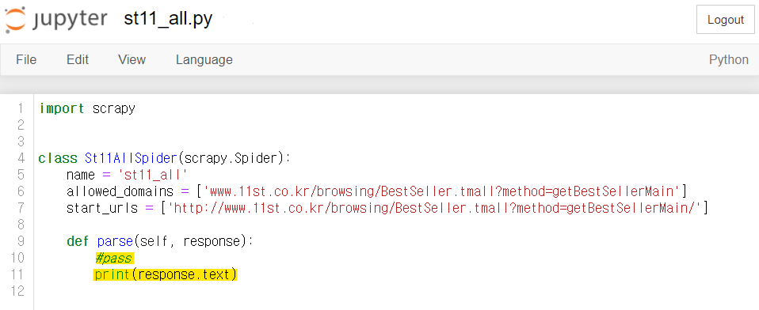

<br>

spider를 실행해봅니다.

```powershell
#명령어 - 터미널에 입력
scrapy crawl <spider 이름>

# 예: 11번가 베스트 카테고리 크롤링 
scrapy crawl st11_all
```

<br>

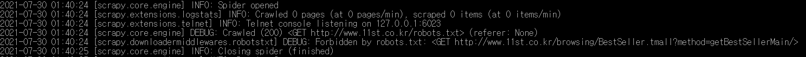

출력된 메세지를 잘 살펴보면 '**DEBUG: Forbidden by robots.txt:**' 라는 문장을 찾을 수 있습니다.

웹페이지 정보도 크롤링되지 않은 것 같아요. 이유가 무엇일까요?

<br>

### 1-2. 1-2. Robots.txt(로봇 배제 표준)

---

웹페이지를 크롤링하기 전에 한 가지 확인해야 되는 것이 있는데, 바로 사이트의 **robots.txt**입니다.

**robots.txt**는 웹사이트의 최상위 디렉토리에 배치되어 있는 텍스트 파일입니다. 사이트의 주소에 **/robots.txt**를 붙여주면 확인할 수 있어요. **robots.txt**는 아래 지시어를 사용해 spider에게 정보를 전달합니다.

##### 대표적인 지시어

| 지시어      | 설명                                                         |      |
| ----------- | ------------------------------------------------------------ | ---- |
| User-agent  | 지시어 정보의 대상이 되는 웹크롤러                           |      |
| Disallow    | 크롤링을 거부할 경로                                         |      |
| Allow       | 크롤링을 허가할 경로                                         |      |
| Sitemap     | XML 사이트 맵의 URL                                          |      |
| Crawl-delay | 웹크롤러가 지켜주길 희망하는 크롤링 시간 간격<br/>(settings.py의 DOWNLOAD_DELAY 설정) |      |

<br>

사실 **robots.txt**는 강제성이 없습니다. 웹크롤러가 지시를 따를지 아닐지는 그것을 만드는 사람의 자유예요. 다만 상대의 웹사이트에 폐를 끼치지 않는 매너 있는 사람이 되고 싶다면 따르는 것을 권장합니다.

<br>

몇 가지 예시를 통해 **robots.txt**를 해석하는 방법을 익혀보겠습니다.

```
# 예 1)
User-agent: *    # 모든 크롤러 대상
Disallow: /      # /로 시작하는 모든 페이지의 크롤링을 허가하지 않음(즉, 사이트 전체)
```

```
# 예 2)
User-agent: *    # 모든 크롤러 대상
Disallow:        # 공백: 모든 페이지의 크롤링을 허가함
```

```
# 예 3)
User-agent: *    # 모든 크롤러 대상
Allow: /page     # /page 하위 경로는 허가 
Disallow: /      # 그 외는 크롤링을 허가하지 않음
```

```
# 예 4)
User-agent: *            # 모든 크롤러 대상
Disallow: /              # 사이트 전체 크롤링 금지

User-agent: Googlebot    # Googlebot 대상
Allow: *                 # 사이트 전체 크롤링 허가
Disallow: /private       # /private 하위 경로는 허가하지 않음
```

<br>

이제 [11번가 사이트의 **robots.txt**](https://www.11st.co.kr/robots.txt)를 확인해보겠습니다.

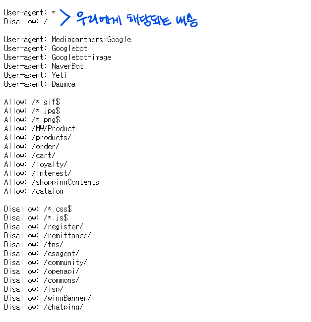

**robots.txt**에 의하면 11번가는 사이트 전체의 크롤링을 금지하고 있습니다 😨

11번가에 문의하니 "브랜드 및 크롤링을 포함하여 저작권 및 상표권 등 지적재산권이 침해되지 않는 범위에서는, 회사의 권리가 미치지 않으므로 이 부분은 별도 관여하지 않는다."라고 답변이 왔습니다. 저희는 단순 학습 목적이니 괜찮은 것 같아요.

11번가가 허용했는데 다른 사이트도 괜찮겠지?라고 생각하지 마시고, **robots.txt**에서 크롤링을 금지하고 있다면 반드시 문의해보시길 바랍니다.

<br>

다시 돌아와서, 11번가와 같이 크롤링을 막아놓은 사이트는 **settings.py**의 설정을 변경해 주면 크롤링이 가능해집니다. [[출처]](https://stackoverflow.com/questions/37274835/getting-forbidden-by-robots-txt-scrapy)

```python
#settings.py
ROBOTSTXT_OBEY = False
```


<br>

spider를 실행해보면 아까와 달리 웹페이지 정보가 크롤링된 것을 확인할 수 있습니다.

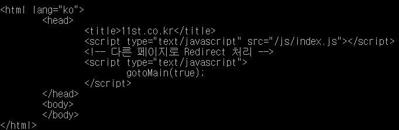

<br>

## 2. 크롤링 데이터 다루기

### 2-1. Item 만들기

---

Item은 spider가 추출한 데이터를 저장할 객체로, 프로젝트의 **items.py**에 정의합니다.

정의하는 방법은 다음과 같습니다.

```python
# 예: 11번가 베스트 카테고리 상풍명을 저장할 클래스
# 클래스(=Item) 이름: Title(사용자 자유)

class Title(scrapy.Item):     # (1) Item 생성 + scrapy.Item 상속
    # define the fields for your item here like:
    # name = scrapy.Field()

  	# 이번 주차에는 상품명만 수집할 예정이라 필드 1개만 생성   
	  title = scrapy.Field()      # (2) 필드명 = scrapy.Field()
```

- **필드(Field)**
  
    : 쉽게 말해 웹사이트의 데이터 중 / 내가 가져오고 싶은 특정 데이터를 / 저장할 객체를 만드는 것
    
    저장할 공간을 만든다고 생각하면 될 거예요.

<br>

Item은 직접 만들어도 되지만 기존의 **St11Item 클래스**를 수정해도 무관해요.

만약 여러 개의 사이트를 크롤링할 생각이라면 **items.py**에 사이트 개수만큼 Item을 만드는 것이 좋습니다.

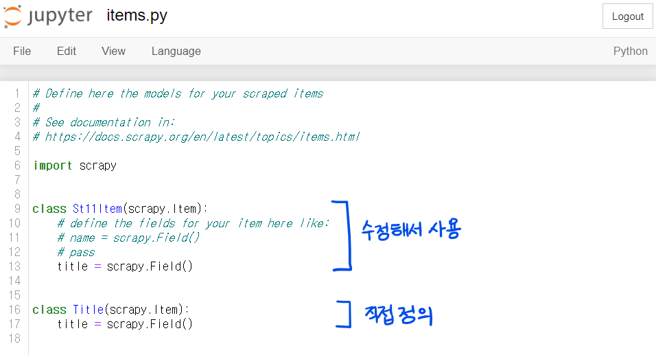

<br>

### 2-2. Spider 수정하기

---

Item을 만들었으니 이제 spider가 추출한 데이터를 Item에 저장해 줄 차례입니다. Item에 데이터를 저장하는 방법은 다음과 같습니다.

- **st11_all.py**
    1. **from** <프로젝트 이름>.items **import** <Item 이름>
    
    2. 객체 = <Item 이름>()
       
        객체명은 사용자 자유. 본 교안에서는 item으로 생성
        
    3. parse 함수에
        1. 객체['필드 이름'] = 추출한 데이터
        2. yield 객체

<br>

무슨 소리일까요? 🙄

**st11_all.py**를 수정하면서 이해해 봅시다.

```python
#st11_all.py
# 11번가 베스트 카테고리 상품명 크롤링

import scrapy
from st11.items import St11Item 혹은 Title    # (1) from <프로젝트 이름>.items import <Item 이름>

class St11AllSpider(scrapy.Spider):
    name = 'st11_all'
    allowed_domains = ['www.11st.co.kr/browsing/BestSeller.tmall?method=getBestSellerMain']
    start_urls = ['http://www.11st.co.kr/browsing/BestSeller.tmall?method=getBestSellerMain']
		
    def parse(self, response):
        # print(response.text)
				# 상품명이 담긴 css 선택자 경로들의 공통 부분을 입력
        # titles의 css 선택자 경로가 아래처럼 입력된 이유를 반드시 고민해 볼 것
				titles = response.css('div#bestPrdList div.viewtype.catal_ty ul li div a div.pname p::text').getall()
				for t in titles:         # t에 상품명 데이터 저장
		        item = St11Item()    # (2) 객체 = <Item 이름>()
	          item['title'] = t    # (3-a) 객체['필드 이름'] = 추출한 데이터
	          yield item           # (3-b) yield 객체
```

<br>

### 2-3. 데이터 저장하기

---

spider가 완성됐어요. 이제 Item의 데이터를 저장할 차례입니다.

```powershell
#명령어 - 터미널에 입력
scrapy crawl <spider 이름> -o <저장할 파일 이름> -t <저장할 파일 형식>
```

spider 실행 명령어에 **-o <저장할 파일 이름>** 과 **-t <저장할 파일 형식>** 을 덧붙이면 돼요.

```powershell
# 예
scrapy crawl st11_all -o st11_all.csv -t csv      # CSV 형식
scrapy crawl st11_all -o st11_all.json -t json    # JSON 형식
```

##### [참고] 저장 가능한 형식

| 확장자        | 형식 설명                                           |
| ------------- | --------------------------------------------------- |
| json          | JSON 형식의 배열                                    |
| jl(jsonlines) | JSON Lines 형식(줄마다 JSON 객체가 들어있는 텍스트) |
| csv           | CSV 형식                                            |
| xml           | XML 형식                                            |
| marshal       | marshal 모듈로 직렬화한 형태의 바이너리 파일        |
| pickle        | pickle 모듈로 직렬화한 형태의 바이너리 파일         |

<br>

CSV 형식으로 저장하는 명령어를 실행해봅시다.

```powershell
#명령어 - 터미널에 입력
scrapy crawl st11_all -o st11_all.csv -t csv
```

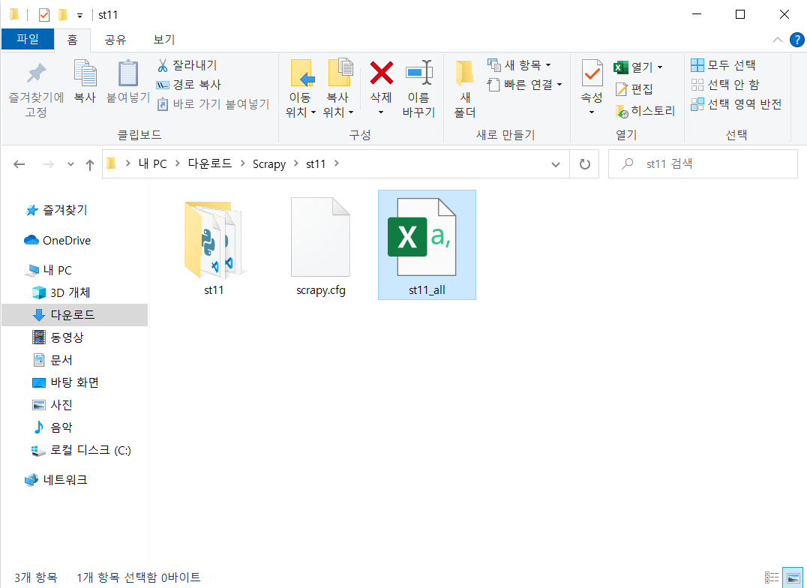

프로젝트 디렉토리에 **st11_all.csv** 파일이 생성된 것을 확인할 수 있습니다.

<br>

그런데 해당 파일을 열어보니 한글이 깨져 나옵니다 🤖

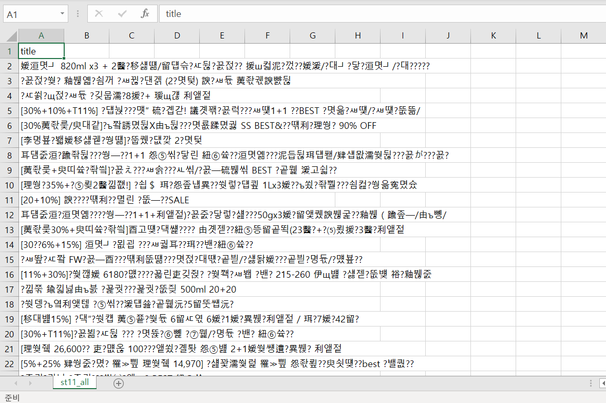

<br>

이러한 한글깨짐 현상은 **settings.py**의 설정을 통해 방지할 수 있습니다.

```python
#settings.py
FEED_EXPORT_ENCODING = 'utf-8'

# 그래도 한글이 깨져 나온다면
FEED_EXPORT_ENCODING = 'cp949'
```

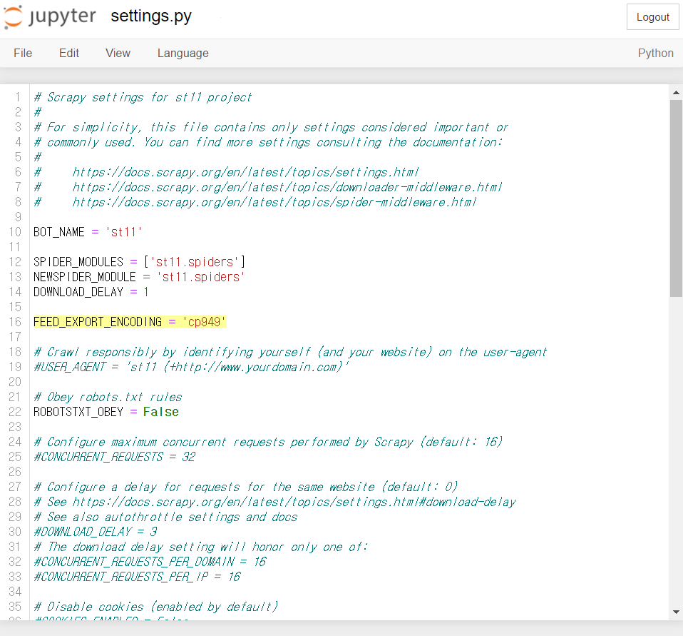

<br>

기존 파일을 삭제한 뒤 명령어를 다시 실행해봅시다. (파일 삭제 필수. 덮어쓰기 안 됨.)

```powershell
scrapy crawl st11_all -o st11_all.csv -t csv
```

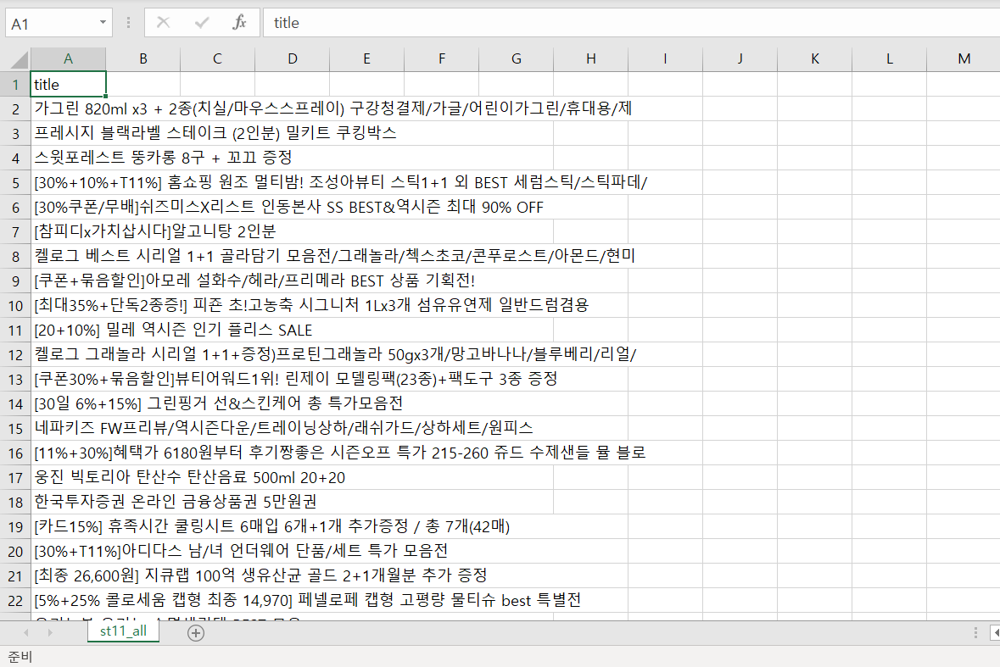

한글깨짐 없이 데이터가 정상적으로 저장되는 것을 확인할 수 있습니다.

<br>

### 2-4. 데이터 후처리하기

---

Item의 데이터를 파일로 저장하기 전 원하는 대로 데이터를 처리할 수 있습니다. 이때 사용하는 것이 **Item Pipeline(이하 Pipeline)**입니다.

<br>

- **Pipeline**
  
    Pipeline은 **process_item()**이라는 특정한 이름의 메서드를 가진 클래스입니다.
    
    프로젝트를 처음 생성했을 때 **pipelines.py**에 클래스의 기본 형태가 아래처럼 작성되어 있어요.
    
    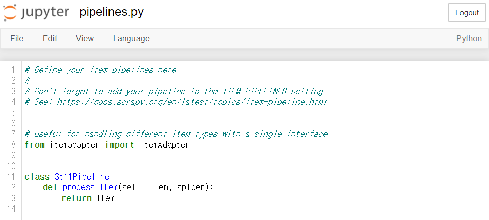
    
    spider의 콜백 함수 **parse()**에서 **yield**한 Item은 반드시 Pipeline의 **process_item()** 메서드를 거쳐가게 됩니다. 따라서 **process_item()** 메서드를 통해 원하는 Item은 **return** 해주고, 원하지 않는 Item은 **raise DropItem**을 통해 필터링하는 것이 가능합니다.
    
    ```python
    # 실제 파일 수정은 하지 말고 눈으로만 읽을 것!
    # 예: 상품가격(판매가격)이 10,000원 이상인 경우에만 상품가격 크롤링
    
    from itemadapter import ItemAdapter
    from scrapy.exceptions import DropItem
    
    class St11Pipeline:
        def process_item(self, item, spider):
            if int(item['price']) > 10000:
                return item
            else:
                raise DropItem('dropitem', item)
    ```
    
    <br>
    
    단, Pipeline을 사용하기 위해서는 **settings.py**에서 다음 코드를 찾아 주석(#)을 없애주어야 합니다.
    
    ```python
    #settings.py
    ITEM_PIPELINES = {
        'st11.pipelines.St11Pipeline': 300,     # 숫자(0 ~ 1000 입력)는 Pipeline의 적용 순서를 의미
    }                                           # 숫자가 작은 것부터 차례대로 적용됨
    ```
    
    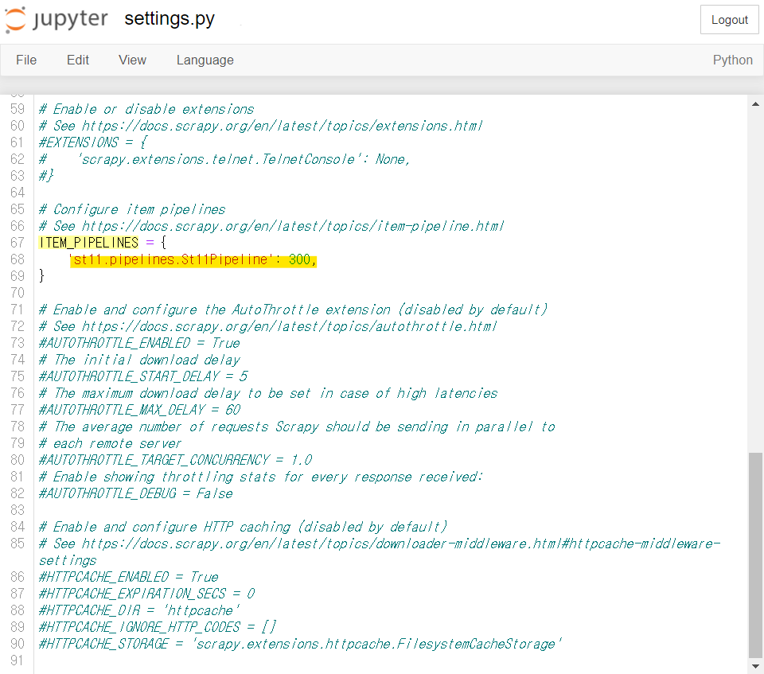
    

<br>

Scrapy는 웹페이지 다운로드 처리, spider의 콜백 함수 처리 등의 다양한 확장 기능을 제공하는데요. 이러한 기능은 프로젝트의 **middleware.py**에서 설정할 수 있습니다. **middleware.py**에 대한 내용은 본 교안에서는 다루지 않습니다. 분량이 매우 방대할뿐더러 코사다마의 커리큘럼만으로는 이해하기 어렵기 때문입니다. 궁금하신 분들은 Scrapy 공식 사이트의 관련 문서를 참고해보세요.

- [[Scrapy] Downloader Middleware](https://docs.scrapy.org/en/latest/topics/downloader-middleware.html) - 웹페이지 다운로드 처리
- [[Scrapy] Spider Middleware](https://docs.scrapy.org/en/latest/topics/spider-middleware.html?highlight=middleware) - spider 콜백 함수 처리

<br>

## ** 2주차 과제

이번 주 과제는 **11번가 베스트 카테고리의 상품가격(판매가격)을 상품명과 함께 크롤링**하는 것입니다.

상품명과 상품가격이 저장된 csv 파일을 제출하시면 돼요 😎

- **생각해야 될 것**
    1. 상품가격(판매가격) 데이터가 담긴 css 선택자 경로는 무엇일까?
       
        scrapy shell로 css 선택자 경로 잘 가져왔는지 확인해보기!
        
    2. parse() 함수를 어떻게 수정해야 될까?

<br>

p.s. 크롤링 해보시면 아마 크롤링 된 상품 데이터가 40개뿐일 거예요. 이는 11번가 웹사이트에서 40개 이상의 상품을 보려면 사이트가 로딩이 되어야 하는데, Scrapy가 이를 인식하지 못하기 때문입니다. (동적 웹사이트 크롤링이 불가능) 이런 경우 selenium과 연동하여 사용하는 것이 일반적인데, 해당 설정은 다소 복잡하기 때문에 40개만 크롤링 하시면 됩니다.

<br>

---

이번 주차는 어떠셨나요?

프레임워크에 대해 처음 공부해보는 것이니 어려운 건 당연해요.(아니라면 다행이고요 😝) 그렇지만 Scrapy 커리큘럼은 주차별 내용이 유기적이기 때문에, 한 주라도 대충 공부하시면 뒷부분이 버거워집니다. 여러 번 반복해서 읽어보시고, 밀리지 않게 주의해 주세요.

모두 정말 수고하셨고 다음 주차에서 뵙겠습니다 🔥