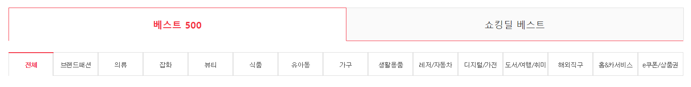
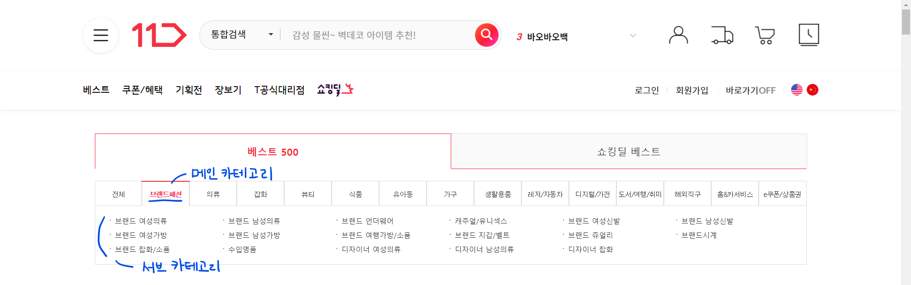
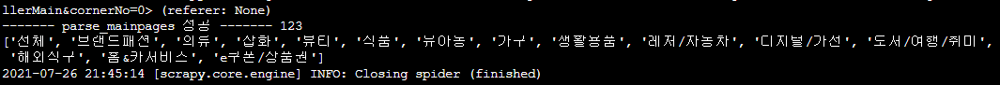
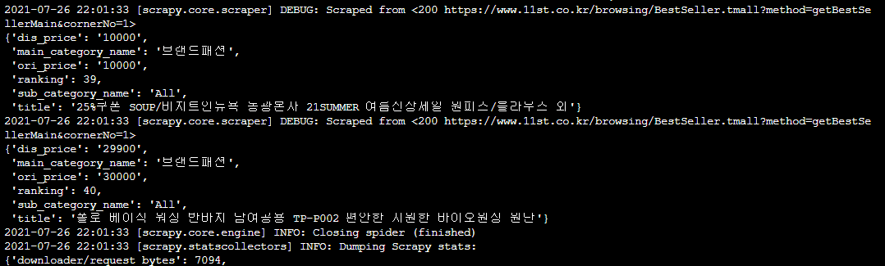
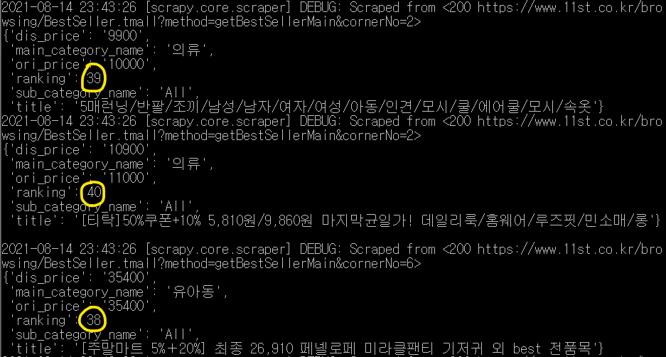
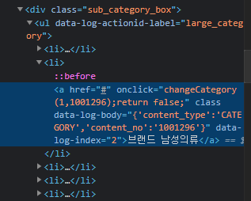
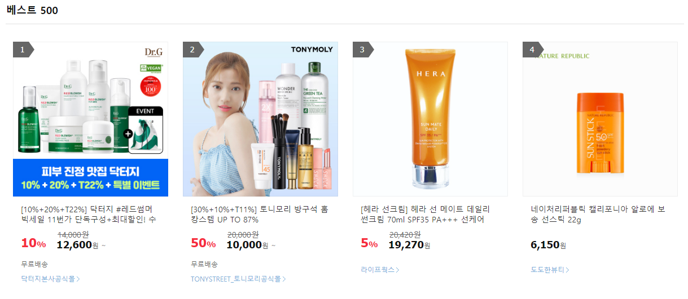
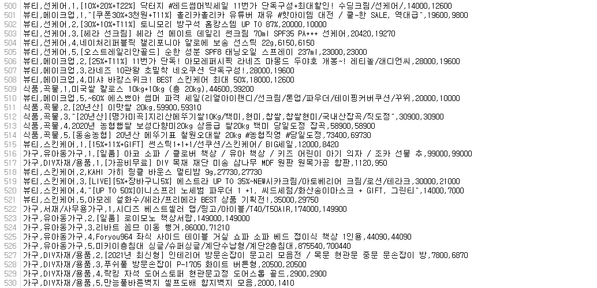

# [Advanced WebCrawling] WEEK3

> 작성자: GMS

※ 본 교안은 노션(notion)에서 작성되었습니다. 마크다운 파일은 가독성이 다소 떨어지며 빠진 파일들이 있습니다.

원래의 교안은 아래 링크에서 확인해주세요 :)

- [노션 링크](https://www.notion.so/cosadama/Advanced-WebCrawling-WEEK3-43cea206af8643e4a563e4c9531f6bf6)


저번 주까지는 11번가 사이트를 통해 Scrapy 사용법을 간단히 알아봤습니다.

이번 주차에는 11번가 사이트의 카테고리별 베스트 상품을 크롤링하고 저장하는 실습을 해보겠습니다 🛒

<br>

##### 📢 **공지사항**

3주차 내용을 바탕으로 4주차 실습이 진행될 예정입니다.

코드가 길다고 겁먹지 마시고 차근차근 반복해서 읽어보세요. 길이만 길뿐 모두 다 배웠던 내용입니다. 스스로 코드를 입력할 때 이해가 훨씬 더 빨리 되니 복붙은 지양해 주세요 😔

이번 주차의 내용을 어떻게 공부하느냐에 따라 다음주에 펼쳐질 풍경이 결정됩니다. 천국행😇 과 지옥행😈, 여러분은 어디를 원하시나요?

<br>

<br>

11번가의 '베스트' 페이지를 들어가면 나오는 주소는 아래의 '**기존 주소**'와 같습니다. 해당 주소로 저번 주에 공부했었죠? 하지만 이번 주에는 다른 메인 카테고리 주소와의 일관성, 편의성을 위해 '**사용할 주소**'로 바꿔 실습할 예정입니다.



'**사용할 주소**' 뒤의 No=0은 0번째 메인 카테고리인 '전체', No=2는 2번째 메인 카테고리인 '의류'에 해당하는 주소를 의미한다는 것만 이해해두시면 됩니다.

- **기존 주소**: [https://www.11st.co.kr/browsing/BestSeller.tmall?method=getBestSellerMain](https://www.11st.co.kr/browsing/BestSeller.tmall?method=getBestSellerMain)
- **사용할 주소**: [https://www.11st.co.kr/browsing/BestSeller.tmall?method=getBestSellerMain&cornerNo=0](https://www.11st.co.kr/browsing/BestSeller.tmall?method=getBestSellerMain&cornerNo=0) (No=각 메인 카테고리의 고유번호)

<br>

## 1. 준비

### 1-1. 프로젝트, Spider(=크롤러) 만들기

---

```powershell
#터미널
# cd 명령어를 이용하여 저번 주에 사용했던, scrapy.cfg가 있는 경로로 먼저 이동

scrapy genspider st11_best "https://www.11st.co.kr/browsing/BestSeller.tmall?method=getBestSellerMain&cornerNo=0"
# 여기서는 https://를 붙이는데, 그 이유는 Request를 배우며 다룰 예정
```

본격적으로 크롤링을 하기 전, 가장 먼저 [11번가 사이트의 **robots.txt**(로봇 배제 표준](https://www.11st.co.kr/robots.txt))을 확인해봐야 합니다. 2주차에서 배웠듯이, 이 사이트는 크롤링을 막아놓았으니 우리는 특정 설정을 **settings.py**에서 변경해 주어야만 크롤링을 실행할 수 있기 때문입니다.

```python
#settings.py
# 기존 settings.py 수정하여 사용
# DOWNLOAD_DELAY = 1   << # 추가해서 주석처리
ROBOTSTXT_OBEY = False # robots.txt 무시
FEED_EXPORT_ENCODING = 'utf-8' # 코드 직접 추가. 인코딩 문제(한글문자 깨짐) 해결 코드
															 # 그래도 깨지면 'cp949'로 바꾸기
```

<br>

### 1-2. Item 만들기

---

11번가 사이트를 한번 확인해보고, 어떤 데이터를 크롤링해서 저장할 것인지 판단하여 **items.py**에 필드명을 정의해줍시다.

우리는 [랭킹, 속한 메인 카테고리명, 서브 카테고리명, 상품명, 기존가격, 할인가격]을 크롤링을 해볼 겁니다. 원하시면 할인율, 무료배송 여부 등을 추가로 넣고 수정해도 됩니다.




```python
#items.py
# 기존의 items.py를 수정하여 사용
import scrapy

class St11Item(scrapy.Item):
    ranking = scrapy.Field()               # 상품 순위
    main_category_name = scrapy.Field()    # 메인 카테고리명
    sub_category_name = scrapy.Field()     # 서브 카테고리명
    title = scrapy.Field()                 # 상품명
    ori_price = scrapy.Field()             # 기존 가격
    dis_price = scrapy.Field()             # 할인 가격
```

<br>

### 1-3. Request 메서드, callback과 meta 파라미터

---

저번 주차에는 크롤링을 할 때 spider에서 콜백 함수 parse()를 이용하여 크롤링을 했었죠? 이번 실습에서는 그때와는 다른 방법으로, **Request 메서드** 내 **callback 파라미터**를 이용하여 크롤링을 해보려 합니다. 구조가 살짝 달라지게 되어서 당황하실 수 있지만 한줄 한줄 뜯어보시면 쉽게 이해하실 수 있을 겁니다 🤪

아래는 Request 메서드에 대한 간단한 설명입니다. **한 번 읽어보면 어려워서 이해가 안 갈 수도 있어요. 그래도 한 번 읽어보고, 예시 코드와 주석을 살펴본 뒤에 다시 읽어보면 이해가 잘 될 겁니다! 그래도 이해가 안 가시면 2주차에 있었던 클래스와 콜백 함수 동영상을 복습한 뒤에 읽어보세요.**

<br>

##### 🤯 **개념잡기: Request 메서드란?**


---

저희가 이용할 Request는 start_urls 대신에 **크롤링할 주소를 요청**하는 역할을 하는 메서드입니다. scrapy.Request로 주소를 요청(request)하고, 그에 대한 응답(response)을 html 파일로 받습니다.

Request 메서드 내부의 "callback" 파라미터는 이 주소를 가지고 downloader가 전달해 주는 **response 객체를 처리할 메서드를 지정하여 호출**해 줍니다.

"meta" 파라미터는 callback이 **처리 요청한 메서드에, 현재 자신이 속한 메서드에서 정의한 변수를 전달**해 줄 수 있습니다. 즉 지역변수를 callback에서 지정해 준 메서드 내에서 재활용할 수 있게 해주는 것이죠.

##### 📖 **용어사전**


---

- 파라미터(=매개변수): 함수에 입력으로 전달된 값을 받는 변수
- 메서드(≒함수): 클래스 안에 들어있는 함수
- 지역변수: 함수 내에서 선언되어 함수 내에서만 사용 가능한 변수

<br>

```python
#st11_best.py
import scrapy

class St11Spider(scrapy.Spider):
    name = 'st11_best'
    # 기존에 있던 allowed_domains와 start_urls는 삭제: 따라서 genspider시 주소에 https://를 붙여줘야 함. 아래 코드들 참고.

    # 순서: 아래 주소를 Request -> self(= 클래스) 안의 parse_mainpages라는 메서드를 실행(callback) -> 거기서 response 객체 처리!
    def start_requests(self): # 첫번째로 선언된 메서드는 기존 parse() 대신 다른 Scrapy 파일들에서 호출됨
        coco = 123
        yield scrapy.Request(url="https://www.11st.co.kr/browsing/BestSeller.tmall?method=getBestSellerMain&cornerNo=0",
                             callback=self.parse_mainpages, # self 내의 이 메서드를 불러 response 처리 일을 이어서 실행
                             meta={'coco123':coco}) # callback 요청한 메서드에 이 데이터를 보내줌. 딕셔너리 형태
        
    def parse_mainpages(self, response): # 위 메서드에서 url의 response에 대해 전달받음.
        print("------- parse_mainpages 성공 -------", response.meta['coco123']) # 위에서 정의한 meta 속 데이터(coco=123)를, 지정해준 이름을 가지고 여기로 불러옴
				# 메인 카테고리명 크롤링
        print(response.css('div.best_category_box li button::text').getall()) # 내려받은 주소로 response 객체 처리 예시
```

```powershell
#터미널
scrapy crawl st11_best
```

<br>



실행해보시면 터미널 중간에 성공적으로 문자열, meta로 내려받은 내용, response를 css로 불러온 내용(메인 카테고리명)이 위 사진처럼 보일 겁니다.

이렇게 scrapy.Request의 callback 파라미터를 이용하면 여러 개의 메서드에 걸쳐 유기적인 연결이 가능해집니다. 이런 방식으로, 주소를 반복문으로 요청하면서 response를 처리한다면 여러 사이트를 크롤링 하기가 쉽겠죠? 앞으로 다룰 '메인 카테고리 → 서브 카테고리'에 걸친 여러 사이트의 크롤링도 이런 방법으로 이루어집니다.

그전에! Scrapy는 하나의 주소(url)를 크롤링 한 상태에서 다시 동일해 보이는 주소를 크롤링하려고 할 시, 두 요청이 동일한 크롤링이라고 보고 반복적으로 크롤링하지 않도록 설정되어 있습니다. 즉 비슷한 주소로 요청(Request)하는 코드가 여러 개인 경우 하나만이 실행된다는 것인데, 이 경우 아래의 설정을 추가해 줘서 모든 요청 코드가 실행될 수 있도록 해줘야 합니다.

```python
#settings.py
DUPEFILTER_CLASS = 'scrapy.dupefilters.BaseDupeFilter' # 코드 직접 추가
```

<br>

## 2. 실습

### 2-1. 메인 카테고리의 베스트 상품 크롤링

---

이제 준비가 완료되었으니 본격적으로 메인 카테고리를 크롤링 하는 코드를 하나하나 작성해보겠습니다. 먼저 각 메서드를 하나하나 살펴보고, 전체 코드를 이해해 봅시다.

그전에, 아래 코드를 보면 **response.css(quiz)라고 적혀있는 코드**들이 있습니다. 이 부분은 **items.py**에서 생성한 필드에 저장할 데이터들이 위치한 css 선택자 경로에 해당하는 내용인데, 1주차 과제에서 Scrapy shell로 찾은 경로를 순서대로 채워 넣어주시기만 하면 됩니다!

```python
#st11_best.py: 1번(주소 불러오기)
# 주소 request하고 callback하는 메서드
def start_requests(self):
    yield scrapy.Request(url="https://www.11st.co.kr/browsing/BestSeller.tmall?method=getBestSellerMain&cornerNo=0",
                         callback=self.parse_mainpages) # 주소를 아래 메서드로 보내고, response 처리 요청
            
# 메인 카테고리
def parse_mainpages(self, response):
    print("parse_mainpages") # callback이 잘 되었는지 확인하기 위함
    category_names = response.css(quiz:메인 카테고리명의 css 선택자 경로).getall() # 메인 카테고리의 이름을 리스트로 불러오기
    for idx, name in enumerate(category_names):
        # 이제 각 메인 카테고리 사이트별(No=)로 response 처리 요청을 보낼 것임
        yield scrapy.Request(url="https://www.11st.co.kr/browsing/BestSeller.tmall?method=getBestSellerMain&cornerNo="+str(idx), 
                             callback=self.parse_items, # parse_items 메서드를 호출해서 실행
                             meta={'maincategory_name':category_names[idx], 'subcategory_name':'All'}) # 이 데이터도 내려보내줌
```

```python
#st11_best.py: 2번(데이터 불러오기)
def parse_items(self, response):
    print('parse_items', response.meta['maincategory_name'], response.meta['subcategory_name']) # 잘 가져와 졌는지 확인
    best_items = response.css('div.viewtype.catal_ty') # 베스트 상품이 위치한 메인 선택자 경로
    for idx, item in enumerate(best_items[1].css('li')): # 같은 선택자 경로가 "도전! 베스트"라고 하나 더 있어서, 두번째 선택자 경로로 지정해줘야 함
                                                         # div의 class가 viewtype.catal_ty인 것 중 2번째 내부의 li들을 이용(&) 
	      doc = St11Item()        
        ranking = idx + 1 # 랭킹은 인덱스에 1을 더해주면 됨
				# 아래 빈칸에는 베스트 상품의 이름에 해당하는 css 선택자 경로를 넣어주면 됨. response.css가 아닌 item.css임을 주의!
        title = item.css(quiz:베스트 상품명의 css 선택자 경로).get().strip() # .strip 함수는 pipelines.py에서 해줘도 가능함. 아래에서 설명
        ori_price = item.css(quiz:기존가격의 css 선택자 경로).get()
        dis_price = item.css(quiz:할인가격의 css 선택자 경로).get() # 반복문이니 getall()이 아닌 get()을 사용함
        
        if ori_price == None: # 할인하지 않는 상품은 기존 가격 데이터가 없으니 할인 가격과 같게 정해줌
            ori_price = dis_price

        ori_price = ori_price.replace(',','').replace('원','') # 이후 분석의 편리를 위해 콤마와 '원'을 삭제
        dis_price = dis_price.replace(',','').replace('원','') # 이것도 pipelines.py에서 후처리 가능함
        
        doc['main_category_name'] = response.meta['maincategory_name'] # 위 메서드에서 가져온 데이터를 Item(필드)에 넣어줌
        doc['sub_category_name'] = response.meta['subcategory_name']
        doc['ranking'] = ranking
        doc['title'] = title
        doc['ori_price'] = ori_price
        doc['dis_price'] = dis_price
 
        yield doc # 마지막으로 Item에 데이터 저장
```

- (&) - 개발자 도구(F12)로 반드시 검색해보기
  
    
    
    <br>

```python
#st11_best.py: 최종 코드
import scrapy
from st11.items import St11Item

class St11BestSpider(scrapy.Spider):
    name = 'st11_best'

    def start_requests(self):
        yield scrapy.Request(url="https://www.11st.co.kr/browsing/BestSeller.tmall?method=getBestSellerMain&cornerNo=0",
                             callback=self.parse_mainpages)
                
    def parse_mainpages(self, response):
        print("parse_mainpages")
        category_names = response.css(quiz:메인 카테고리명의 css 선택자 경로).getall()
        for idx, name in enumerate(category_names):
            yield scrapy.Request(url="https://www.11st.co.kr/browsing/BestSeller.tmall?method=getBestSellerMain&cornerNo="+str(idx), 
                                 callback=self.parse_items,
                                 meta={'maincategory_name':category_names[idx], 'subcategory_name':'All'})
                        
    def parse_items(self, response):
        print('parse_items', response.meta['maincategory_name'], response.meta['subcategory_name'])
        best_items = response.css('div.viewtype.catal_ty')
        for idx, item in enumerate(best_items[1].css('li')):
            doc = St11Item()
            
            ranking = idx + 1
            title = item.css(quiz:베스트 상품명의 css 선택자 경로).get().strip()
            ori_price = item.css(quiz:기존가격의 css 선택자 경로).get()
            dis_price = item.css(quiz:할인가격의 css 선택자 경로).get()
            
            if ori_price == None:
                ori_price = dis_price
            ori_price = ori_price.replace(',','').replace('원','')
            dis_price = dis_price.replace(',','').replace('원','')
            
            doc['main_category_name'] = response.meta['maincategory_name']
            doc['sub_category_name'] = response.meta['subcategory_name']
            doc['ranking'] = ranking
            doc['title'] = title
            doc['ori_price'] = ori_price
            doc['dis_price'] = dis_price
     
            yield doc
```

<br>

만약 실행이 잘 되었다면 이런 결과가 터미널에 쭈~욱 나올 겁니다. 직접 사이트의 내용과 맞는지 대조해보세요 🧐



<br>

참고로 실행 화면에서 랭킹이나 카테고리 등이 순서대로 출력되지 않을 수 있습니다. 데이터와 item들의 순서가 뒤죽박죽인 이유는, Scrapy가 크롤링 할 때 여러 개의 spider(크롤러)가 작동하기 때문입니다. 여러 개의 spider가 크롤링 하면서 속도는 빨라지지만, 빠른 순서대로 크롤링하기 때문에 크롤링하여 출력, 저장되는 순서는 섞이게 되는 것이죠.



<br>

### 2-2. 메인 카테고리, 서브 카테고리의 베스트 상품 크롤링

---

이제 서브 카테고리의 베스트 상품까지 크롤링해봅시다. 위의 코드를 그대로 가져오면서 중간 부분을 약간만 손볼 예정입니다. 어디가 어떻게 바뀌었는지, 메서드끼리 어떻게 연결되어 있는지 확인해보면서 수정해보세요!

서브 카테고리 주소는 메인 카테고리 주소 + "&dispCtgrNo=1001295"의 형식입니다. 뒤의 서브 카테고리 고유번호(1001296)를 알려주는 css 선택자 경로를 html 파일에서 찾아내고, 그 주소를 크롤링 하는 코드를 더해주기만 하면 되겠네요!

- 예시 주소: [https://www.11st.co.kr/browsing/BestSeller.tmall?method=getBestSellerMain&cornerNo=1&dispCtgrNo=1001296](https://www.11st.co.kr/browsing/BestSeller.tmall?method=getBestSellerMain&cornerNo=1&dispCtgrNo=1001296)

<br>

메인 카테고리와 서브 카테고리 주소를 이용할 때 아래의 css 선택자 경로에서 **a**의 **onclick**이라는 속성을 이용할 예정입니다. 참고하고 코드를 확인해보세요.

- 예: (브랜드패션, 브랜드 남성의류) == (1, 1001296) == (메인 카테고리 고유번호, 서브 카테고리 고유번호)



```python
#st11_best.py: 1번(메인 카테고리 주소 불러오기)
def parse_mainpages(self, response):
    print("parse_mainpages")
    category_names = response.css(quiz:메인 카테고리명의 css 선택자 경로).getall()
    for idx, name in enumerate(category_names):
        yield scrapy.Request(url="https://www.11st.co.kr/browsing/BestSeller.tmall?method=getBestSellerMain&cornerNo="+str(idx), 
                             callback=self.parse_items, 
                             meta={'maincategory_name':category_names[idx], 'subcategory_name':'All'})
		# 이 위까지는 이미 있던 코드

    # 이제는 서브 카테고리 크롤링을 위한 request도 추가해주자: 위 반복문과 거의 비슷함. callback과 meta만 약간의 차이
    for idx, name in enumerate(category_names):
        yield scrapy.Request(url="https://www.11st.co.kr/browsing/BestSeller.tmall?method=getBestSellerMain&cornerNo="+str(idx), 
                             callback=self.parse_subcategory, # 서브카테고리를 크롤링하는 메서드로
                             meta={'maincategory_name':category_names[idx],'index':idx}
                            )
```

```python
#st11_best.py: 2번(서브 카테고리 주소 불러오기)
def parse_subcategory(self, response):
    print('parse_subcategory', response.meta['maincategory_name']) # meta로 전달받은 데이터 확인
    subcategory_names = response.css(quiz:서브 카테고리명의 css 선택자 경로).getall() # 전체 서브 카테고리 이름을 리스트로
    # 아쉽게도 서브 카테고리 정보는 메인 카테고리 별로 명확히 나뉘어져 있지 않아서 다른 정보를 이용해야함

    # 주소에 들어가는 (메인 카테고리 고유번호, 서브 카테고리 고유번호) 값을 위의 사진에서 나온 선택자 경로에서 확인할 수 있으니 이 정보를 이용
    subcategory_lists = response.css('div.sub_category_box li a::attr("onclick")').re('\(.*\)') # 데이터 중 괄호 안의 정보를 크롤링해오기
    subcategory_idcs = []
    for i in subcategory_lists:
				# category_lists 내 변수들이 문자열로 되어 있으므로 튜플 형태로 바꿔주기 위함
				# i는 '(1,1001296)'라는 문자열 형태, 바꾸고자 하는 튜플 형태는 (1,1001296)
        if i[2] == ',':
            subcategory_idcs.append((int(i[1]),int(i[3:-1])))
        else:
            subcategory_idcs.append((int(i[1:3]),int(i[4:-1])))
    
    for idx, sub in enumerate(subcategory_idcs): # idx = 부여된 인덱스 번호, sub = (메인 카테고리 고유번호, 서브 카테고리 고유번호) 형태의 튜플
        if sub[0] == response.meta['index']: # 만일 메인 카테고리 고유번호 == meta로 가져온 메인 카테고리 인덱스 번호면: 메인 카테고리가 일치하니 서브 카테고리 정보를 가져옴
            yield scrapy.Request(url="https://www.11st.co.kr/browsing/BestSeller.tmall?method=getBestSellerMain&cornerNo=" + str(sub[0]) + "&dispCtgrNo=" + str(sub[1]), 
                                 callback=self.parse_items, # 메인 카테고리와 마찬가지로 크롤링 하는 메서드로!
                                 meta={'maincategory_name':response.meta['maincategory_name'], 
                                                                  'subcategory_name':subcategory_names[idx]}
                                )
        else: # 반면, 서브 카테고리가 메인 카테고리에 속하지 않는 경우, 즉 메인 카테고리 인덱스 번호가 둘이 서로 다른 경우는 그냥 넘어감.
            continue

```

```python
#st11_best.py: 최종
import scrapy
from st11.items import St11Item

class St11BestSpider(scrapy.Spider):
    name = 'st11_best'

    def start_requests(self):
        yield scrapy.Request(url="https://www.11st.co.kr/browsing/BestSeller.tmall?method=getBestSellerMain&cornerNo=0",
                             callback=self.parse_mainpages)
        
    def parse_mainpages(self, response):
        print("parse_mainpages")
        category_names = response.css(quiz:메인 카테고리명의 css 선택자 경로).getall()
        for idx, name in enumerate(category_names):
            yield scrapy.Request(url="https://www.11st.co.kr/browsing/BestSeller.tmall?method=getBestSellerMain&cornerNo="+str(idx), 
                                 callback=self.parse_items, 
                                 meta={'maincategory_name':category_names[idx], 'subcategory_name':'All'})
        for idx, name in enumerate(category_names):
            yield scrapy.Request(url="https://www.11st.co.kr/browsing/BestSeller.tmall?method=getBestSellerMain&cornerNo="+str(idx), 
                                 callback=self.parse_subcategory, 
                                 meta={'maincategory_name':category_names[idx],'index':idx}
                                )
    
    def parse_subcategory(self, response):
        print('parse_subcategory', response.meta['maincategory_name'])        
        subcategory_names = response.css(quiz:서브 카테고리명의 css 선택자 경로).getall()
        subcategory_lists = response.css('div.sub_category_box li a::attr("onclick")').re('\(.*\)')
        subcategory_idcs = []
        for i in subcategory_lists:
            if i[2] == ',':
                subcategory_idcs.append((int(i[1]),int(i[3:-1])))
            else:
                subcategory_idcs.append((int(i[1:3]),int(i[4:-1])))
        
        for idx, sub in enumerate(subcategory_idcs):
            if sub[0] == response.meta['index']:
                yield scrapy.Request(url="https://www.11st.co.kr/browsing/BestSeller.tmall?method=getBestSellerMain&cornerNo=" + str(sub[0]) + "&dispCtgrNo=" + str(sub[1]), 
                                     callback=self.parse_items,
                                     meta={'maincategory_name':response.meta['maincategory_name'], 
                                                                      'subcategory_name':subcategory_names[idx]}
                                    )
            else:
                continue

    # 메인 카테고리, 서브 카테고리의 정보를 모두 크롤링하는 메서드. 코드는 처음과 동일
    def parse_items(self, response):
        print('parse_items', response.meta['maincategory_name'], response.meta['subcategory_name'])
        best_items = response.css('div.viewtype.catal_ty')
        for idx, item in enumerate(best_items[1].css('li')):
            doc = St11Item()
            
            ranking = idx + 1
            title = item.css(quiz:베스트 상품이름의 css 선택자 경로).get().strip()
            ori_price = item.css(quiz:할인전가격의 css 선택자 경로).get()
            dis_price = item.css(quiz:할인된가격의 css 선택자 경로).get()
            
            if ori_price == None:
                ori_price = dis_price
            ori_price = ori_price.replace(',','').replace('원','')
            dis_price = dis_price.replace(',','').replace('원','')
            
            doc['main_category_name'] = response.meta['maincategory_name']
            doc['sub_category_name'] = response.meta['subcategory_name']
            doc['ranking'] = ranking
            doc['title'] = title
            doc['ori_price'] = ori_price
            doc['dis_price'] = dis_price
     
            yield doc

# 메인 카테고리 크롤링 과정: start_requests -> parse_mainpages -> parse_items
# 서브 카테고리 크롤링 과정: start_requests -> parse_mainpages -> parse_subcategory -> parse_items
# ㄴ 서브카테고리가 메인 카테고리 안에 있기 때문에 서브 카테고리라도 메인 카테고리를 거쳐가야 함. 
```

위 코드를 작성 후 실행한 뒤에, 약 30초 정도 아까 본 실행 결과가 쭉 나올 겁니다. 이제는 성공적으로 크롤링 되었는지 확인하기 전에 데이터 후처리와 설정을 수정해봅시다.

<br>

### 2-3. 데이터 후처리 및 저장

---

하나의 카테고리 당 최대 500개의 베스트 상품이 있고 크롤링 하면 2주차처럼 각각 40개씩 데이터가 나올 텐데, 저장하기에는 너무 많으니 후처리를 통해 랭킹 1위~5위까지만 저장을 해봅시다.

```python
#pipelines.py
from itemadapter import ItemAdapter
from scrapy.exceptions import DropItem

class St11Pipeline:
    def process_item(self, item, spider):
        if int(item['ranking']) <= 5:    # 랭킹이 5보다 작거나 같으면
            return item    # 그대로 return
        else: 
            raise DropItem("순위권 밖", item)    # 아니면 raise error
```

<br>

**pipelines.py**를 수정했으니 설정으로 pipeline을 사용한다고 정의해줘야겠죠? 그리고 데이터 저장을 예쁘게 하기 위해 저장될 아이템들의 순서를 정해줍시다.

```python
#settings.py
ITEM_PIPELINES = {    # 주석(#)만 없애주면 됨
    'st11.pipelines.St11Pipeline': 300,
}

# 아이템 출력 순서 설정: 직접 코드 추가
FEED_EXPORT_FIELDS = ['main_category_name', 'sub_category_name', 'ranking', 'title', 'ori_price', 'dis_price']
```

##### ❓  **궁금해요:** 아이템 순서를 지정하지 않으면 어떻게 되나요?


---

이렇게 됩니다 ☹


<br>

이제 마지막으로 크롤링한 데이터를 저장하고, 잘 크롤링 되었는지 사이트와 몇 개 비교하며 확인해봅시다.

```powershell
#터미널
# DOWNLOAD_DELAY 설정을 하면 너무 느려질 수 있으니, 반드시 주석처리 한 뒤 실행할 것!!!
scrapy crawl st11_best -o st11_best.csv -t csv
```

명령을 수행한 디렉토리에 파일이 잘 저장되었는지 확인해보시기 바랍니다. 저장한 결과 파일의 데이터 수는 205(전체 카테고리 개수) * 5(순위) = 1025(전체 데이터 수)여야 하는데 숫자가 달라서 파이썬에서 pd.read_csv로 살펴보니, '홈&카서비스'의 서브 카테고리에서 랭킹이 5위까지 없는 서브 카테고리가 있었습니다. 제가 크롤링할 당시 사이트에서 직접 세보니 17개의 데이터가 부족했고 csv 파일의 첫번째 줄은 아이템명(컬럼명)이니 csv 파일은 1009줄로 알맞게 저장되어 있었습니다.

마지막으로, 파일을 확인해보면 저장이 잘 된 것을 확인할 수 있었습니다. 그리고 무작위로 정한 (뷰티, 선케어) 항목의 베스트 상품 내용과 csv 파일에 저장된 내용을 직접 대조해보면 정보가 정확히 일치하여 잘 크롤링 된 것을 확인할 수 있습니다 😆





<br>

## ** 3주차 과제

이번 주 과제는 **11번가의 모든 메인 카테고리, 서브 카테고리의 베스트 상품들을 1~5위까지 저장한 csv 파일을 제출**하는 것입니다.

위 실습 코드의 비어있는 css 선택자 경로를 채워 넣고 그대로 시행한 뒤, 저장한 csv 파일을 제출해 주시기만 하면 됩니다! 정말 간단하죠? 저장된 파일의 데이터를 11번가 사이트와 직접 비교해보며 제대로 크롤링이 되었는지 반드시 확인해보시고 제출해 주시기 바랍니다!

<br>

---

3주차에서는 Request 메서드와 callback, meta 파라미터에 대해 새로 배워보았고, 이를 이용해 여러 사이트에 걸친 크롤링 실습을 해보았습니다. 내용이 언뜻 보면 어려워 보일 수도 있지만 callback 파라미터의 기능을 잘 이해하시고, 메서드끼리 어떻게 연결되어 진행되는지만 추적해 보셨다면 어렵지 않게 이해하셨을 겁니다!

다음 주부터는 지금까지 배운 내용을 토대로, 여러분 스스로가 처음부터 크롤링 할 코드를 짜볼 예정이니 이번 주차 내용을 충분히 이해하시고 복습해보시면 큰 도움이 될 겁니다.

이번 주도 정말 수고 많으셨고, 다음 주차에도 열심히 공부해보아요 🔥
