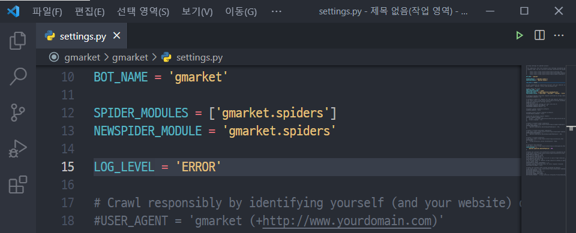
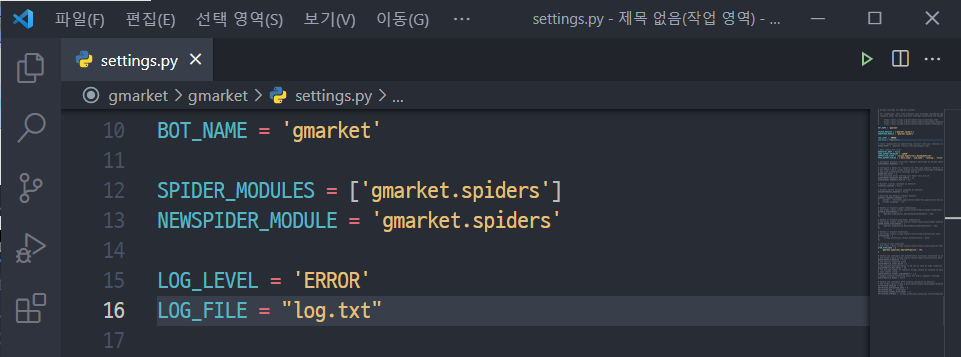

# [Advanced WebCrawling] WEEK4

> 작성자: 신윤진

※ 본 교안은 노션(notion)에서 작성되었습니다. 마크다운 파일로 변환하면서 빠진 파일들이 있습니다.

완전한 내용의 교안은 아래 링크에서 확인해주세요 :)

- [노션 링크](https://www.notion.so/cosadama/Advanced-WebCrawling-WEEK4-47d1d67a39664ed6aa50a3e5bb76e10d)


이번 주차에는 텍스트 에디터를 설치해보려고 해요 😲

정들었던 jupyter notebook을 떠나 프로그래밍에 한 발짝 더 다가가보는 것이죠.

<br>

이를 기념하여 [G마켓 사이트의 베스트 카테고리](http://corners.gmarket.co.kr/Bestsellers) 크롤링 실습 과제도 준비해 봤습니다.

예상 과제 수행 시간은 **6시간 이상**이에요. 그동안 공부를 설렁설렁했다면 수행 시간이 배가 되겠죠? 😖

**실습 과제는 질의응답을 하지 않습니다. 대신 과제 기한을 한 달로 늘렸어요.**

알 수 없는 오류에 머리를 싸매며, 수많은 난관을 정복해가는 짜릿함을 알아가시길 바랍니다 🤩

<br>

##### 📢 **공지사항**


---

본 교안에서 Visual Studio Code(VS Code) 관련 영상은 자바스크립트(JavaScript)를 예시로 설명됩니다.

왜 파이썬이 아닌지 궁금하실 텐데요. 프로그래밍 언어만 다를 뿐 VS Code를 사용하는 데는 큰 차이가 없기 때문입니다. 강사님이 파이썬을 예시로 설명해 주시는 영상도 있지만, 자바스크립트 영상이 좀 더 최근에 촬영됐고 유용한 기능들을 추가로 설명해 주십니다.

프로그래밍 언어가 다르다고 대충 보지 마시고 꼼꼼히 시청해 주세요 😚

<br>

<br>

## 1. 실습 환경 준비

2주차에서 언급했던 텍스트 에디터를 설치해 보겠습니다.

간단한 py 파일 수정이라면 jupyter notebook도 괜찮지만, 긴 코드를 작성하기에는 정~말 불편하기 때문입니다.

저희는 텍스트 에디터 중 가장 인기 있는 VS Code를 사용할 예정이에요.

아래 영상들을 따라 신세계를 여행해보시길 바랍니다 👩‍🚀

<br>

### 1-1. VS Code 설치하기

---

**2분 30초부터 시청**해주세요.

- 혼공 자바스크립트 1강 - 1.2절 개발 환경 설치: [https://youtu.be/pwR0y76Od_U?t=151](https://youtu.be/pwR0y76Od_U?t=151)

<br>

### 1-2. VS Code 사용 팁 ⭐

---

- 혼공 자바스크립트 4강 - Visual Studio Code 환경 설정하기: [https://youtu.be/2qqJUx_S33M](https://youtu.be/2qqJUx_S33M)

<br>

### 1-3. VS Code에서 작업하기

---

기본적인 사용법에 대한 영상들입니다. 집중해서 봐주세요 🍿

- **기본 사용법**
  
    [https://www.youtube.com/watch?v=K8qVH8V0VvY](https://www.youtube.com/watch?v=K8qVH8V0VvY)
    
- **(보충) 작업 영역 사용 영상** -- 노션에서 확인해주세요 :)

<br>

## 2. Scrapy Logging

Scrapy를 실행했을 때 출력되는 로그는 처음에는 신기하지만, 장황한 탓에 오류 메세지를 찾기 힘들게 합니다.

- 순간포착 오류 메세지 찾기 🔍
    - 숨은 오류 찾기.mp4 -- 노션에서 확인해주세요 :)


<br>

이러한 고민은 **settings.py**에 LOG_LEVEL 설정을 추가해 해결할 수 있습니다.

##### 💡 **개념잡기: LOG_LEVEL 설정**


---

LOG_LEVEL은 표시할 메세지의 수준을 결정합니다. Scrapy의 표준적인 LOG_LEVEL은 총 5가지입니다.

1. CRITICAL — 최고 심각도
2. ERROR — 추천
3. WARNING
4. INFO
5. DEBUG — 최저 심각도, 기본 설정과 동일

로그 수준을 WARNING으로 설정하면 CRITICAL, ERROR, WARNING 로그만 출력되고, DEBUG로 설정하면 모든 로그가 출력됩니다. 수준을 변경하면서 차이를 파악해보세요.

##### 📖 **참고하기: 로깅(Logging)이란?**


---

로깅이란 로그를 기록하는 행위를 말합니다.

프로그래밍에서 로그(Log)는 운영체제나 소프트웨어가 실행하는 도중 발생하는 이벤트, 혹은 각기 다른 사용자의 통신 소프트웨어 간의 메세지를 의미합니다.

출처: [[위키백과] 로그파일](https://ko.wikipedia.org/wiki/%EB%A1%9C%EA%B7%B8%ED%8C%8C%EC%9D%BC)

<br>

```python
#settings.py
LOG_LEVEL = 'ERROR'    # 직접 입력
```



- 편안해진 오류 찾기.mp4 -- 노션에서 확인해주세요 :)

오류 메세지를 찾기 매우 쉬워졌네요 😆

<br>

이외에도 출력되는 print문을 보고 어느 부분이 잘못됐는지 파악할 수 있습니다. 3주차의 **st11_best.py**에 작성했던 print문 3개를 기억하시나요?

- 기억이 나지 않는다면...
  
    ```python
    #st11_best.py: 최종
    import scrapy
    from st11.items import St11Item
    
    class St11BestSpider(scrapy.Spider):
        name = 'st11_best'
    
        def start_requests(self):
            yield scrapy.Request(url="https://www.11st.co.kr/browsing/BestSeller.tmall?method=getBestSellerMain&cornerNo=0",
                                 callback=self.parse_mainpages)
            
        def parse_mainpages(self, response):
            print("parse_mainpages")
            category_names = response.css(quiz:메인 카테고리명의 css 선택자 경로).getall()
            for idx, name in enumerate(category_names):
                yield scrapy.Request(url="https://www.11st.co.kr/browsing/BestSeller.tmall?method=getBestSellerMain&cornerNo="+str(idx), 
                                     callback=self.parse_items, 
                                     meta={'maincategory_name':category_names[idx], 'subcategory_name':'All'})
            for idx, name in enumerate(category_names):
                yield scrapy.Request(url="https://www.11st.co.kr/browsing/BestSeller.tmall?method=getBestSellerMain&cornerNo="+str(idx), 
                                     callback=self.parse_subcategory, 
                                     meta={'maincategory_name':category_names[idx],'index':idx}
                                    )
        
        def parse_subcategory(self, response):
            print('parse_subcategory', response.meta['maincategory_name'])        
            subcategory_names = response.css(quiz:서브 카테고리명의 css 선택자 경로).getall()
            subcategory_lists = response.css('div.sub_category_box li a::attr("onclick")').re('\(.*\)')
            subcategory_idcs = []
            for i in subcategory_lists:
                if i[2] == ',':
                    subcategory_idcs.append((int(i[1]),int(i[3:-1])))
                else:
                    subcategory_idcs.append((int(i[1:3]),int(i[4:-1])))
            
            for idx, sub in enumerate(subcategory_idcs):
                if sub[0] == response.meta['index']:
                    yield scrapy.Request(url="https://www.11st.co.kr/browsing/BestSeller.tmall?method=getBestSellerMain&cornerNo=" + str(sub[0]) + "&dispCtgrNo=" + str(sub[1]), 
                                         callback=self.parse_items,
                                         meta={'maincategory_name':response.meta['maincategory_name'], 
                                                                          'subcategory_name':subcategory_names[idx]}
                                        )
                else:
                    continue
    
        # 메인 카테고리, 서브 카테고리의 정보를 모두 크롤링하는 메서드. 코드는 처음과 동일
        def parse_items(self, response):
            print('parse_items', response.meta['maincategory_name'], response.meta['subcategory_name'])
            best_items = response.css('div.viewtype.catal_ty')
            for idx, item in enumerate(best_items[1].css('li')):
                doc = St11Item()
                
                ranking = idx + 1
                title = item.css(quiz:베스트 상품이름의 css 선택자 경로).get().strip()
                ori_price = item.css(quiz:할인전가격의 css 선택자 경로).get()
                dis_price = item.css(quiz:할인된가격의 css 선택자 경로).get()
                
                if ori_price == None:
                    ori_price = dis_price
                ori_price = ori_price.replace(',','').replace('원','')
                dis_price = dis_price.replace(',','').replace('원','')
                
                doc['main_category_name'] = response.meta['maincategory_name']
                doc['sub_category_name'] = response.meta['subcategory_name']
                doc['ranking'] = ranking
                doc['title'] = title
                doc['ori_price'] = ori_price
                doc['dis_price'] = dis_price
         
                yield doc
    ```
    

'parse_mainpages '와 'parse_subcategory'은 출력되는데 'parse_items'가 보이지 않는다면, **parse_items 메서드**에 문제가 있다고 추측할 수 있는 것이죠. 메서드와 반복문 중간중간 print문을 넣고 실행해, 코드를 잘 작성하고 있는지 확인하는 것을 추천드립니다 👨‍🔧

<br>

만약 로그를 파일로 저장하고 싶다면 2가지 방법이 있습니다.

1. **settings.py**
   
    **settings.py**에 **LOG_FILE = '<파일명>.txt'**을 추가합니다.
    
    ```python
    #settings.py
    # 예
    LOG_FILE = 'log.txt'    # 직접 입력
    ```
    
    
    
   <br>
   
1. **spider 실행 명령어**

    spider 실행 명령어에 **-s LOG_FILE=<파일명>.log** 를 덧붙입니다.

    ```powershell
    # 예
    scrapy crawl st11_best -s LOG_FILE=st11.log
    scrapy crawl gg -s LOG_FILE=gg.log
    ```

    - LOG_FILE.mp4 -- 노션에서 확인해주세요 :)

이렇게 하면 로그는 모두 파일에 저장되고, 터미널에는 사용자가 작성한 print문만 출력됩니다.

<br>

로그에 대한 더 자세한 내용은 Scrapy 공식 사이트의 관련 문서를 참고해보세요.

- [[Scrapy] Logging](https://docs.scrapy.org/en/latest/topics/logging.html)

<br>

## ** 실습 과제

실습 과제는 3주차 과제와 유사합니다. **G마켓 사이트의 모든 메인 카테고리, 서브 카테고리의 베스트 상품 1~5위를 크롤링**하면 돼요.

- G마켓 robots.txt 확인하기: [https://www.gmarket.co.kr/robots.txt](https://www.gmarket.co.kr/robots.txt)
- G마켓 베스트 카테고리 주소: [http://corners.gmarket.co.kr/Bestsellers](http://corners.gmarket.co.kr/Bestsellers)

<br>

- **크롤링해야 되는 데이터(순서 지킬 것)**
    1. 메인 카테고리명
    2. 서브 카테고리명
    3. 상품 순위
    4. 상품명
    5. 기존 가격
    6. 할인 가격
    7. 할인율(new)

<br>

- **조건**
    1. 기존 가격이 없을 경우 할인 가격과 같게 해줄 것
    2. 할인율이 없으면 '0'으로 처리할 것
    3. **pipelines.py 설정을 통해** 가격에서 쉼표(,)를 없애고, '원'은 '냥'으로 바꿔줄 것 (예: 200,102원 > 200102냥)
    4. LOG_LEVEL은 ERROR로 설정할 것

<br>

- **힌트**
    - **G마켓은 11번가와 달리 카테고리 주소(url)를 담고 있는 태그가 있다. 이 태그의 경로를 적극 활용할 것** 🧭

    - settings.py에 추가해야 되는 설정 빠트리지 말 것
      
        (꼭 넣어주세요 ^^ 안 그러면 정신 나갑니다. 어떻게 아냐고요? 저도 알고 싶지 않았어요...)

<br>

- **제출해야 되는 파일(ZIP으로 압축)**
    1. 크롤링 데이터가 담긴 csv 파일
    2. 로그파일
    3. **pipelines.py** 파일


<br>

---