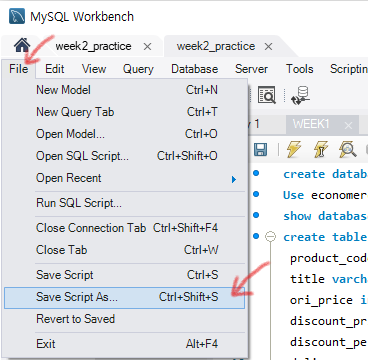

# COSADAMA - BASIC SQL WEEK2

작성자: 이정윤, 정 찬

참고자료: SQL/SB(MySQL)기본부터 파이썬/데이터분석 활용까지! (잔재미코딩), 부스트코드 1-1 SQL 및 관계형 데이터베이스(모원서), SQLite3로 가볍게 배우는 데이터베이스: SQL 기초 실습(최용), [백문이 불여일타] 데이터 분석을 위한 기초/중급/고급 SQL(데이터리안), DATABASE 1&2 - MySQL(Egoing Lee)

# 테이블 조작법 - SQL 문법 및 활용

코사다마의 데이터 Basic SQL 스터디 2주차를 시작합니다 🙌🙌🙌

## 0. 머릿말

2주차에는 1주차에 공부했던 SELECT에 이어서 **Join**과 **서브쿼리**와 관련된 **SQL문법**들을 공부하고, 활용을 위한 **연산자**와 **함수**를 학습합니다. SQL 쿼리에 익숙해지기 위해 문제를 만들어 보았습니다. 힌트와 아래 첨부한 SQL CHEAT SHEET, 구글링 등 적극적으로 활용하여 문제 풀이에 도전해보세요!

또한 분석에 필요한 데이터를 가공한 분석용 데이터인 '**데이터 마트'**에 대해서도 알아보는데요, 이름은 생소하지만 사실은 Python의 Pandas로 데이터 전처리하는 과정과 유사합니다. 방대한 데이터 속에서 필요한 것만 뽑거나, 일부를 활용해 새로운 컬럼을 추가한 pivot_table을 만드는 것처럼 말이죠!

View와 Procedure의 경우 테이블을 조작하는 부분이 급하다고 판단해 커리큘럼에서는 제외했습니다. 업무를 더 효율적으로 할 수 있는 도구이니 필요하거나 관심 있으신 분들은 학습하시는 것도 좋을 것 같습니다😉

## 1. 스터디 주제

| 주제        | 배우는 내용                                                  | 학습 내용        | 강의 URL                                                     | 실습                                                         |
| ----------- | ------------------------------------------------------------ | ---------------- | ------------------------------------------------------------ | ------------------------------------------------------------ |
| 1. SQL 문법 | 1) SQL 문법 - 테이블 결합(JOIN) - 서브쿼리(Sub Query) | 부스트 코스 강의 | https://www.boostcourse.org/ds102/joinLectures/114927?isDesc=false | 강의 보면서 workbench로 따라하기. (강의 3개)                 |
| 2. SQL 활용 | 2) SQL 활용 - 연산자 및 함수(1) - 연산자 및 함수(2) - 데이터 마트 | 부스트 코스 강의 | https://www.boostcourse.org/ds102/joinLectures/114929?isDesc=false | 강의 보면서 workbench로 따라하기.  (강의 4개. View 및 Procedure 제외) |

## 2. 과제

| 과제                                                 | 과제 링크                                                    | 설명                                    | 힌트                                                         |
| ---------------------------------------------------- | ------------------------------------------------------------ | --------------------------------------- | ------------------------------------------------------------ |
| 코사다마학교 학생 명단을 DB로! (1주차에 이어서) | https://www.notion.so/cosadama/DB-1-e7e231e11d4746b489fcf39ad5d08a12 | 교안 순서대로  Workbench 에서 따라하기! | 분산 구하는 힌트: SELECT variance(대출 도서수) FROM COSADAMA |

## 3. 과제 제출하기

- '코사다마 회원 명단을 DB로!'과제는 교안의 순서대로 Workbench에서 실습 진행한 뒤, 해당 파일을 저장해서 제출하면 됩니다. 

- 파일 저장은 File > Save Script AS... 에서 SQL Files 형식으로  저장하면 됩니다.

  

  - 기한: 

  - 과제 제출시 Slack assignment 채널에 아래와 같은 제목으로 SQL Files 형식의 파일을 제출해 주시면 됩니다. 다른 스터디와 구분 짓기 위함이니 이렇게 해주시면 감사하겠습니다:)

    > [SQL]고다람_2주차 과제.sql

  

## 4. 공부를 끝내며

