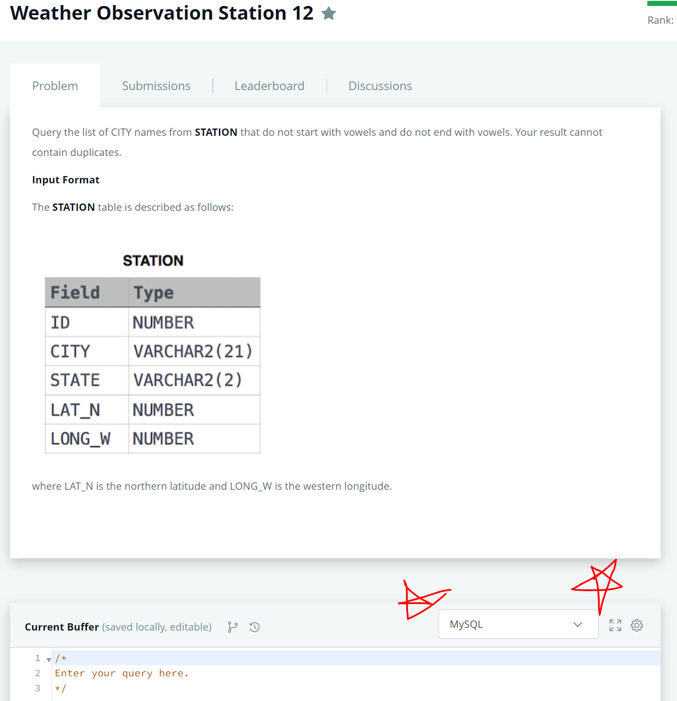
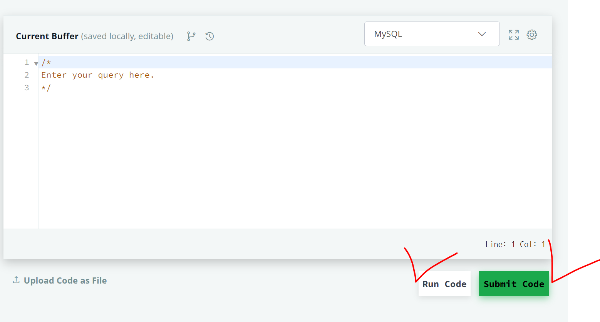
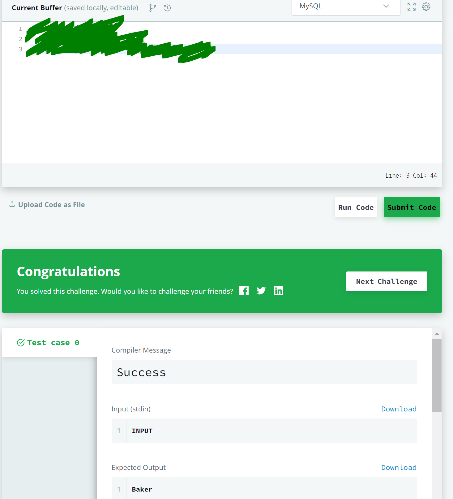
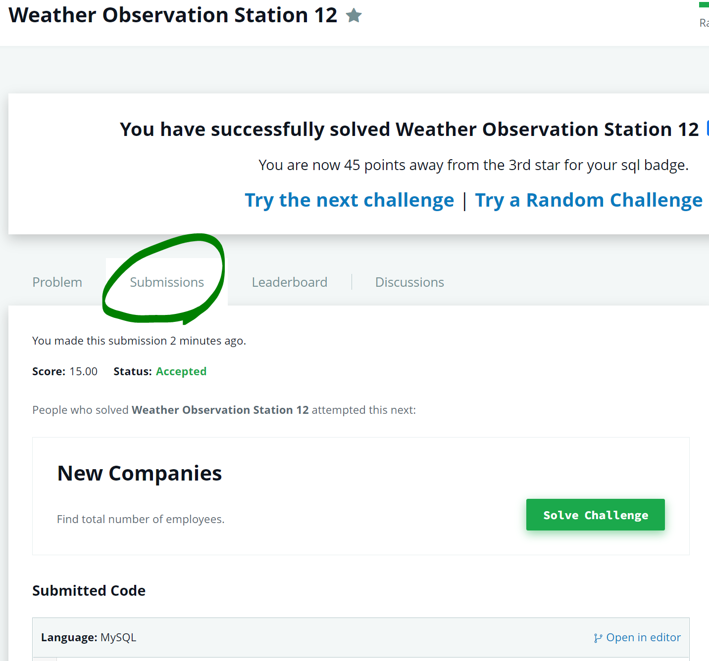

# 2021 BASIC SQL - WEEK3

작성자: 이정윤, 정 찬

참고자료: SQL/SB(MySQL)기본부터 파이썬/데이터분석 활용까지! (잔재미코딩), 부스트코드 1-1 SQL 및 관계형 데이터베이스(모원서), SQLite3로 가볍게 배우는 데이터베이스: SQL 기초 실습(최용), [백문이 불여일타] 데이터 분석을 위한 기초/중급/고급 SQL(데이터리안), DATABASE 1&2 - MySQL(Egoing Lee)

# 실전 데이터 분석 및 프로젝트

코사다마의 데이터 Basic SQL 스터디 3주차를 시작합니다 🚀🚀🚀

## 머릿말

3주차에는 1, 2주차에서 공부한 MysQL 문법, 연산자를 활용해 간단한 데이터 분석 연습을 할 예정입니다. 몇천만, 몇억 규모의 대규모 데이터는 파이썬이나 R로도 불러오는 것 자체가 일이 될 수도 있어요. 전통적 데이터 산업인 보험업계처럼 수많은 사람들의 건강, 직업, 질병, 보험료, 예상 지급액, 경제 흐름 등등 대용량의 데이터를 다루는 경우에 SQL은 거의 필수라고 할 수 있습니다. 데이터가 주 무기인 요즘 산업들은 더하겠죠? 그럼 열심히 배워 봅시다!

## 스터디 주제 및 강의

| 주제               | 배우는 내용                        | 학습내용 | 강의                                                         | 실습                                         |
| ------------------ | ---------------------------------- | -------- | ------------------------------------------------------------ | -------------------------------------------- |
| 1. SQL 데이터 분석 | SQL을 통해 데이터 조작 및 분석하기 | 강의     | https://www.boostcourse.org/ds102/joinLectures/114931?isDesc=false | 강의 보면서 workbench로 따라하기. (강의 5개) |

프로젝트 가이드를 따라서 workbench에서 실습해주세요!🥰

## 과제

이번주에는 [해커랭크](https://www.hackerrank.com)에서 제공하는 MySQL 문제를 풀어서 제출해 주시면 됩니다. 뒤로 갈 수록 난이도가 높아지니까 주의하세요!

| name                                          | URL                                                          | hint                 |
| --------------------------------------------- | ------------------------------------------------------------ | -------------------- |
| 1. Employee Salaries                          | https://www.hackerrank.com/challenges/salary-of-employees/problem | 연산자, order by     |
| 2. African Cities                             | https://www.hackerrank.com/challenges/african-cities/problem | equi-join            |
| 3. Average Population of Each Continent       | https://www.hackerrank.com/challenges/average-population-of-each-continent/problem | select query         |
| 4. Revising Aggregations - The count Function | https://www.hackerrank.com/challenges/revising-aggregations-the-count-function/problem | distinct             |
| 5. Revising Aggregations - Averages           | https://www.hackerrank.com/challenges/revising-aggregations-the-average-function/problem | avg()                |
| 6. Population Density Difference              | https://www.hackerrank.com/challenges/population-density-difference/problem | min(), max()         |
| 7. Weather Observation Station4               | https://www.hackerrank.com/challenges/weather-observation-station-4/problem | count()              |
| 8. Top Earners                                | https://www.hackerrank.com/challenges/earnings-of-employees/problem | *                    |
| 9. Weather Observation Station12              | https://www.hackerrank.com/challenges/weather-observation-station-12/problem | 노가다 or 정규표현식 |

### 유의사항

1. 회원가입 하시는 편을 추천드립니다. 문제를 어떻게 풀었는지 자동 저장되기 때문에 나중에 확인할 수도 있고, 운이 좋으면 1등에 rank되기도 한답니다:)

2. 설정 언어를 MySQL로 바꿔주세요! Oracle 등 다른 언어와 문법이 조금씩 다르기 때문에 분명히 맞게 작성해도 틀리다고 할 수 있습니다.

   

3. Run과 Submit Code 버튼을 통해 코드를 확인하고, 정답이라면 제출하세요!

   

4. 정답이라면 이렇게 초록색 창이 뜬답니다:)

   

   이런 식으로 본인의 쿼리와 성공한 화면을 캡처해서 zip 파일로 제출해주세요! 만약 이 화면을 넘어갔다면

   

   상단의 **submissions**를 확인하세요!

5. 혹시 너무 어려워서 힌트가 필요하시면 과제 표의 hint 컬럼을 확인하세요!

   

   

   

## 과제 제출

- 기한: 

- 과제 제출 시 슬랙 assignment 채널에 아래와 같은 제목으로 캡처 화면을 [SQL]고다람_n주차 과제.zip 파일로 올려주시면 됩니다. 다른 스터디와 구분을 짓기 위함이니 해주시면 이렇게 해주시면 감사하겠습니다.

  > [SQL]고다람_3주차 과제.zip

## 공부를 끝내며

