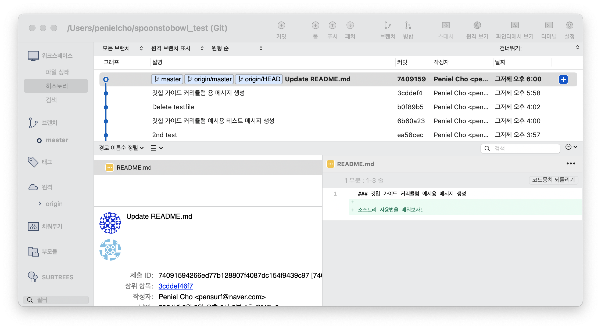
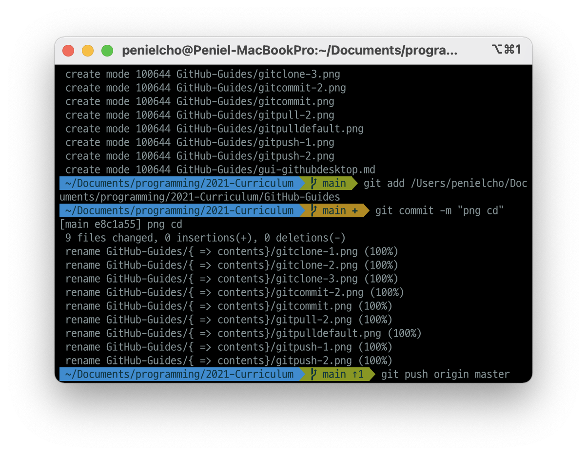

# 깃(git)이 뭔가요?

### 깃이란?

깃(Git)은 버전 관리 시스템의 일종이에요. 버전 관리 시스템은 파일 변화를 시간에 따라 기록했다가 나중에 특정 시점의 버전을 다시 꺼내올 수 있는 시스템이고요. 깃과 다른 버전 관리 시스템의 차이점은 심화 커리큘럼에서 소개할게요.

### 깃의 역할

#### 1. 버전 관리
파일 수정할 때 최종, 진짜_최종, 진짜_진짜_최종의 경험, 다들 있으시죠? 이 무한의 굴레, 깃이 해방시켜줄 거에요. 깃은 문서를 수정할 때마다 언제, 어떤 부분을 수정했는지 구체적으로 기록해주기 때문이죠.

#### 2. 백업
백업 공간을 제공하는 클라우드 서비스는 드롭박스부터 구글 드라이브까지 다양하죠. 이 중 깃 전용 클라우드 서비스가 있어요. [GitLab](https://gitlab.com/), [Bitbucket](https://bitbucket.org/) 등 다양한 서비스가 있지만 가장 많이 사용되는 서비스는 [GitHub](https://github.com/)입니다.

#### 3. 협업
누가 어느 부분을 어떻게 수정했는지 세세하게 기록으로 남겨주어 이슈 대응이 쉽고, 클라우드 서비스를 통해 각종 버전을 다운로드, 업로드가 가능해 팀 프로젝트에 최적화되어 있어요.

### 깃 사용 환경

#### 1. GUI

Graphic User Interface의 약자로, 기능을 알기 쉬운 아이콘 등의 그래픽을 통해 사용자가 쉽고 편리하게 git을 사용 가능하도록 하는 방식을 의미합니다. 초보자도 사용이 쉽고 직관적이지만 git의 모든 기능을 지원하지는 않습니다. 대표적인 git GUI 소트프웨어로는 [GitHub Desktop](https://desktop.github.com/), [SourceTree](https://www.sourcetreeapp.com/) 등이 있습니다. 위 사진은 [SourceTree](https://www.sourcetreeapp.com/)의 레포지토리 히스토리 화면 예시입니다.

#### 2. CLI

Command Line Interface의 약자로, 터미널(윈도우는 Git Bash)에서 직접 git 명령어를 입력 받는 방식입니다. GUI와 달리 명령어를 알고 있어야만 사용이 가능합니다. 깃의 모든 기능을 사용 가능하며 깃 개념 이해에 도움을 준다는 장점이 있습니다. 위 사진은 터미널(iTerm)을 통한 git 명령어 사용 예시입니다.

>GUI의 경우 버튼 하나로 해결될 일이 CLI는 수번의 명령어를 입력해야 기능합니다. 편의성 측면에서는 GUI가 우수하나 git 각 기능의 개념을 이해하는 데에는 CLI를 사용하는 것이 좋습니다. 본 커리큘럼은 편의성보다 깃 개념 이해가 우선이라 판단, CLI를 사용합니다.