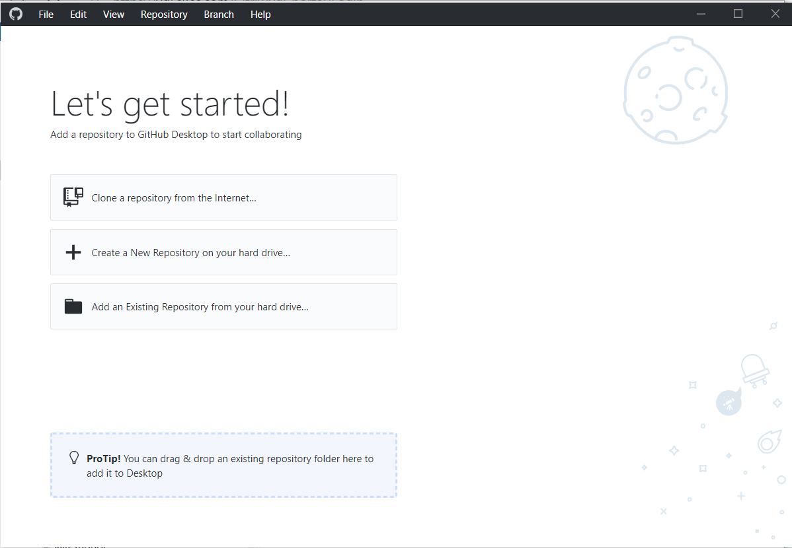
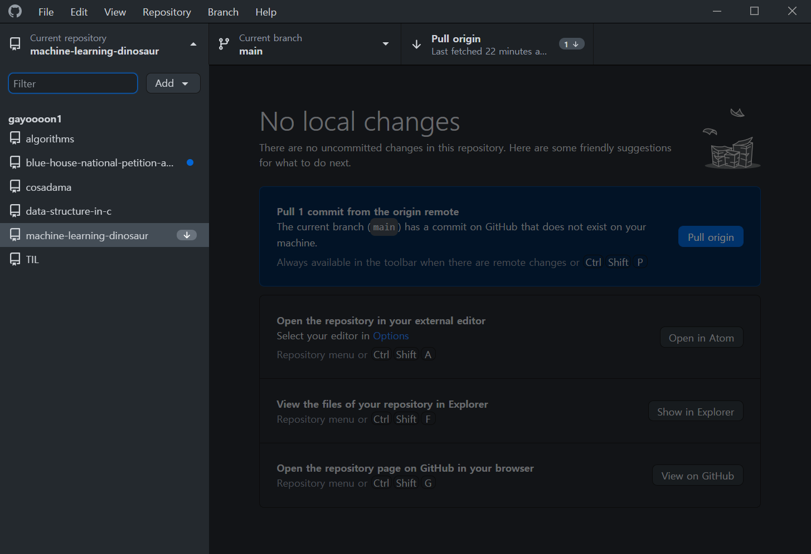
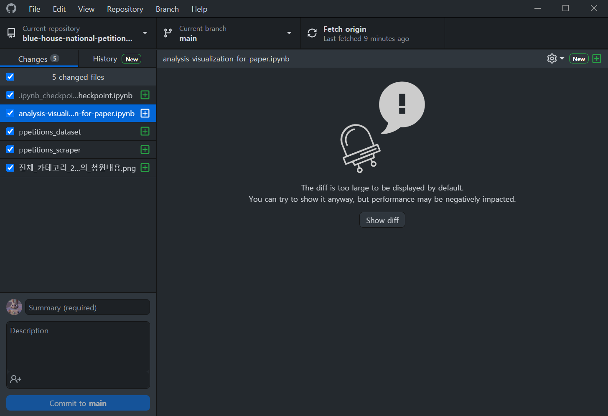
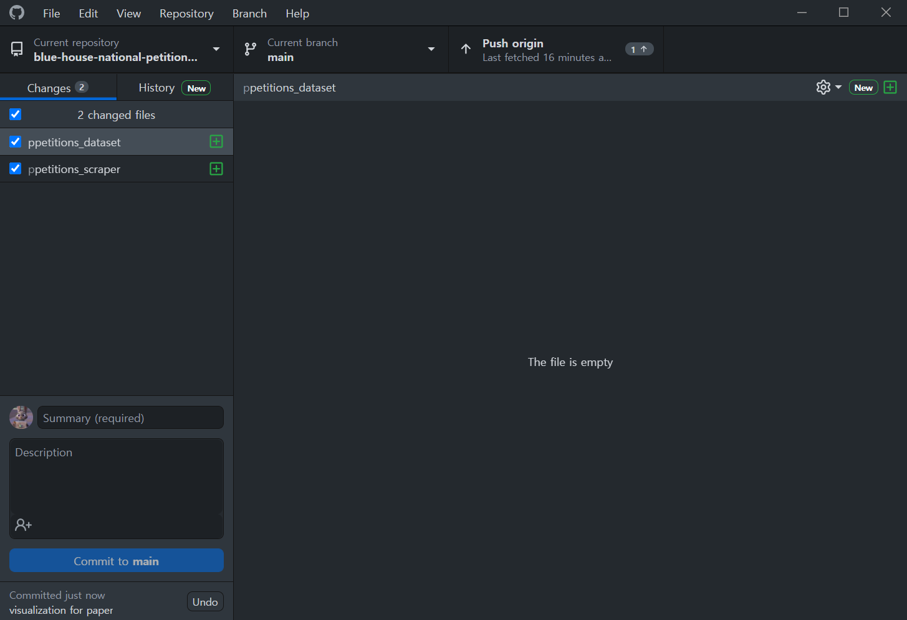

# GUI 사용하기 - GitHub Desktop

안녕하세요 여러분 😉 앞서 소개해드렸던 GitHub Desktop 사용법에 대해서 간단히 배워봅니다. 앞서 [깃이 뭔가요?](https://www.notion.so/7f89fd577d53467aa0815043abf581d5) 에서 알려드렸던 것처럼 Desktop 버전은 화면을 보면서 쉽게 git 작업을 할 수 있는 그래픽 사용자 인터페이스(Graphical User Interface, GUI) 입니다. 저희가 배워본 CLI(Command Line Interface) 보다는 사용자가 편리하게, 쉽게 사용할 수 있도록 기능을 알기 쉬운 아이콘 등으로 그래픽으로 나타낸 것입니다. 들어가기에 앞서 말씀드리자면, CLI 버전보다는 기능이 너무 제한 되어 있기 때문에 CLI에서 다룰 수 있는 –amend -f같은 옵션이나, reset, revert, rebase 등과 같은 고급 옵션은 사용할 수 없습니다. 하지만 주요 기능을 보다 쉽게 다뤄볼 수 있다는 점에서 git 초보자들이 믿고 따라 쓸 수 있는, 깔끔한 툴이에요 😊 실제로 간단한 작업에 저도 많이 사용하고 있어요. 그럼 사용법을 간단히 알아볼까요?   

## git clone   
### Let's get started!   
   
처음 설치를 마치면 아래와 같은 화면이 나타납니다. 이 화면에서는 “Clone a repository from the internet…" 을 실행하면 팝업 화면이 나타나는데, 본인의 깃헙 계정과 연결하기 위해 sign in을 누르면 됩니다. 그러면 자신의 계정으로 접근 가능한 모든 repository 목록이 나와요!   
초기 설치 이후에 clone을 하고 싶다면 왼쪽 상단의 File → Clone repository 를 누르면 됩니다.   
   
원하는 repository를 선택하고, Local Path에 다운로드할 위치를 지정해줍니다. 저는 거의 Documents 내 GitHub 문서에 생성해둡니다. 이후에 Clone을 눌러줄게요. 그럼 끝!   
   
Current repository 옆에 있는 조그만 삼각형을 클릭하면 Add 버튼이 나타납니다. 여기서 Clone repository를 클릭해도 clone할 수 있습니다.   

## git commit (+add)   
   
GitHub Desktop 에서는 git add와 commit을 동시에 할 수 있습니다. 화면 왼쪽 아래에 commit message와 description (선택) 을 작성하면 commit to 버튼이 활성화 됩니다. 그러면 버튼을 눌러주세요. 밑의 캡쳐를 보시면 캡쳐에서는 파일크기가 커서 나오지 않지만, 코드 등을 수정했을 경우 바뀐 부분이 나오게 됩니다.   
   
Commit을 마쳤습니다! 🤗   

## git push   
   
Commit to main 버튼을 누르면 오른쪽 상단에 Push origin이 생깁니다. 이것을 눌러주면 Push 완료! 😎   
   
다음과 같이 현재의 브랜치가 master가 아닌 경우에 (즉, 사설 branch인 경우에는) Push를 마치고 나서 다음과 같이 master로 Pull request를 하라는 버튼을 GitHub가 알아서 띄워줍니다.   

## git pull   
   
만약 원격 저장소에서 변경된 사항이 있어서, 현재 checkout한 브랜치가 뒤쳐져 있는 있는 경우, GitHub Desktop이 이를 알아서 상태를 파악하고 Pull을 하라는 버튼을 보여줍니다. 만약 이 버튼이 보이지 않는다면, pull해올 것이 없다는 의미입니다.   
    

[참조 및 이미지](https://engineering-skcc.github.io/github%20pages/github-pages-desktop/)
