# GUI 사용하기 - SourceTree

GUI 소프트웨어의 일종인 SourceTree 사용법에 대해 간단히 배워볼게요. GitHub Desktop이 더 유명하고 보편화되어 있음에도 SourceTree 교안을 따로 마련한 이유는 명령이 비교적 세분화되어 있기 때문이에요. 명령이 세분화되어 있다는 건 생략되는 과정이 적다는 의미고, 이는 CLI 사용 흐름을 이해를 도울 수 있어요.

자, 그럼 본격적으로 SourceTree 사용법을 배워볼까요?

## 설치 및 설정

### 맥에서 설치하기

맥 사용자 분들은 [applebuddy님의 블로그 포스팅](https://0urtrees.tistory.com/166)을 보고 설치해주세요.

### 윈도우에서 설치하기

윈도우 사용자 분들은 [사악미소님의 블로그 포스팅](https://velog.io/@saakmiso/Windows-%ED%99%98%EA%B2%BD-SourceTree-%EC%84%A4%EC%B9%98%ED%95%98%EA%B8%B0)을 보고 설치해주세요.

### 로컬 작업 폴더(Working Directory) 연결 및 생성하기

존재하는 로컬 작업 폴더를 소스트리에서 열기 위해서는 다음 [공식문서](https://confluence.atlassian.com/get-started-with-sourcetree/add-an-existing-local-repository-847359105.html)를 참고해주세요.

로컬에 작업 폴더를 생성하기 위해서는 다음 [공식문서](https://confluence.atlassian.com/get-started-with-sourcetree/create-a-local-repository-847359103.html)를 참고해주세요.

### 깃헙 계정 연결하기

깃헙 계정 연결을 위해서는 다음 [공식문서](https://confluence.atlassian.com/get-started-with-sourcetree/connect-your-bitbucket-or-github-account-847359096.html)를 참고해주세요.

## 설치

### 맥에서 설치하기
맥 사용자 분들은 [applebuddy님의 블로그 포스팅](https://0urtrees.tistory.com/166)을 보고 설치해주세요.

### 윈도우에서 설치하기
윈도우 사용자 분들은 [사악미소님의 블로그 포스팅](https://velog.io/@saakmiso/Windows-%ED%99%98%EA%B2%BD-SourceTree-%EC%84%A4%EC%B9%98%ED%95%98%EA%B8%B0)을 보고 설치해주세요.

## 사용법

설치 및 깃헙 연동을 완료했다면 직접 사용해봅시다. 가장 많이 사용할 git add, git commit, git push, git pull, git clone하는 법을 예시와 함께 알아볼게요.

spoonstobowl_test라는 로컬 폴더(Working Directory)가 있고, 동일한 이름의 레포지토리가 해당 폴더에 연결되어 있는 상태입니다. 로컬 폴더 내 파일 중 README 파일에 약간 변화를 줬고, 해당 파일 변화를 레포지토리에 커밋하려고 해요.

### git add
[로컬에서 스테이지로, 스테이지에서 레포지토리로](./stage-concept.md)에서 배운 바와 같이, git add는 특정 파일들의 변화를 골라 스테이지 공간에 저장하는 명령어입니다. SourceTree에서 git add 하는 방법을 살펴봅시다. 먼저 파일 상태 탭으로 들어가봅니다.
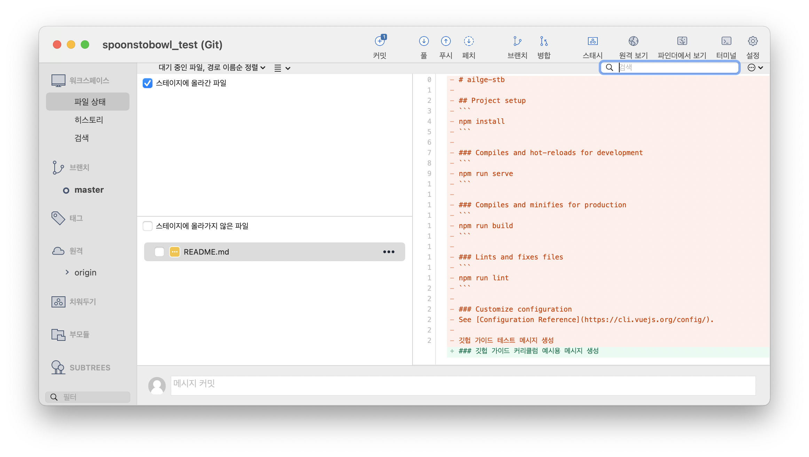
스테이지에 올라간 파일, 스테이지에 올라가지 않은 파일 두가지 탭이 보이실 거에요. 혹시 안 보이실 경우 '대기중인 파일, 경로 이름 순 정렬' 옆 햄버거 모양 메뉴 버튼을 눌러 '스테이지 뷰 나누기 옵션'을 선택해주세요.

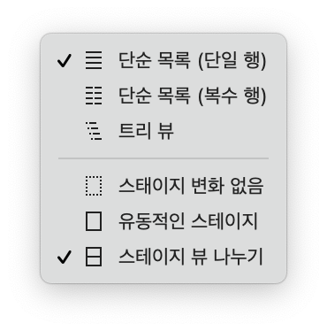

저희는 변화가 있는 파일들 중 특정 파일들을 스테이지로 옮겨야 하니(git add), 스테이지에 올라가지 않은 파일 중 스테이지로 올리고 싶은 파일들을 선택해줄게요. 지금은 README.md 파일에만 변화가 있어 하나의 파일만 선택지로 존재하지만, 다양한 파일에서 변화가 있었다면 많은 선택지가 있었을 거에요. 해당 파일을 클릭하면 아래와 같이 스테이지에 올라간 파일 탭으로 이동한 걸 보실 수 있을 거에요. 

이렇게 하면 git add 완료! 간단하고 직관적이죠?

### git commit
이제 커밋을 해봅시다. add를 통해 스테이지로 올라온 파일 변화들을 묶어주는 게 커밋이었죠. add 이후 상단을 보면 커밋 버튼에 숫자로 알림이 떠 있을 거에요.
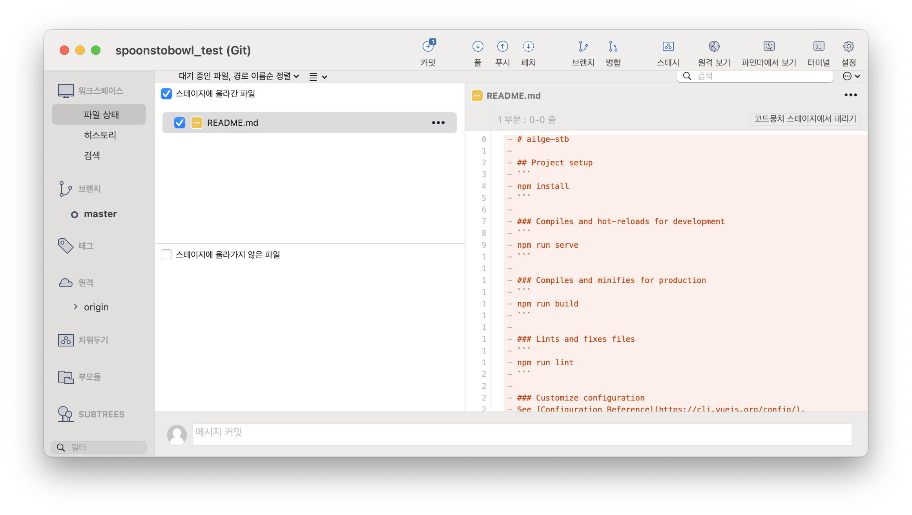
커밋 버튼을 클릭해봅시다.
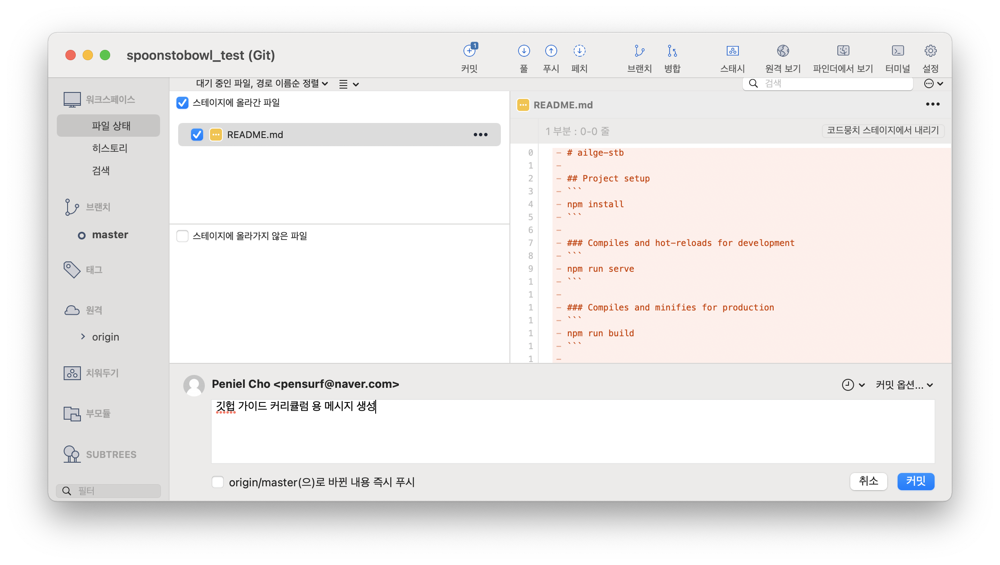
위 사진처럼 하단부에 코멘트 상자와 커밋 버튼이 나타날 거에요. CLI 명령어의 git commit -m "커밋 설명"에서 설명 부분을 코멘트 상자에 적어준다고 생각하면 돼요. 코멘트를 다 적었다면 커밋을 눌러주면 되는데, 이때 왼쪽을 보면 origin/master로 바뀐 내용 즉시 푸쉬라는 체크박스가 있죠. 저 체크 박스를 누르면 커밋과 동시에 푸쉬가 이뤄져요. 편리한 방법이지만, 저희는 지금 개념적인 부분에 집중하기 위해 한번에 푸쉬까지 하지 않고 커밋만 해줄게요.
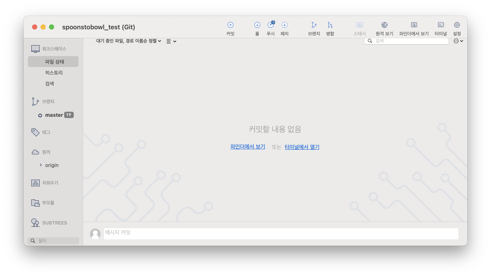
커밋을 마치면 파일 상태 탭이 '커밋할 내용 없음'이라는 안내와 함께 텅 비게 돼요.

### git push
커밋을 마쳤으니, 푸쉬를 해봐야겠죠? 브랜치 탭의 master 브랜치를 선택해주세요.
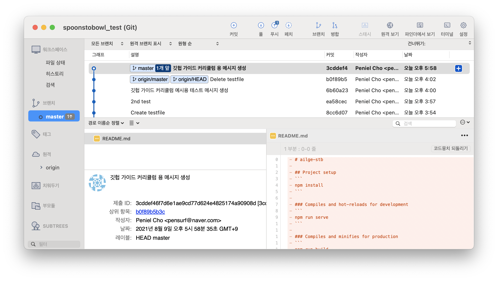
master 브랜치와 커밋과 함께 적은 메시지가 보이네요. 그런데 그 사이에 '1개 앞'이라는 알림이 있네요. 이건 로컬 폴더(Working Directory)가 레포지토리의 상태보다 1커밋 앞서 있다는 뜻이에요. 그럼 빨리 레포지토리와 로컬 폴더의 상태를 even하게 만들어줍시다.
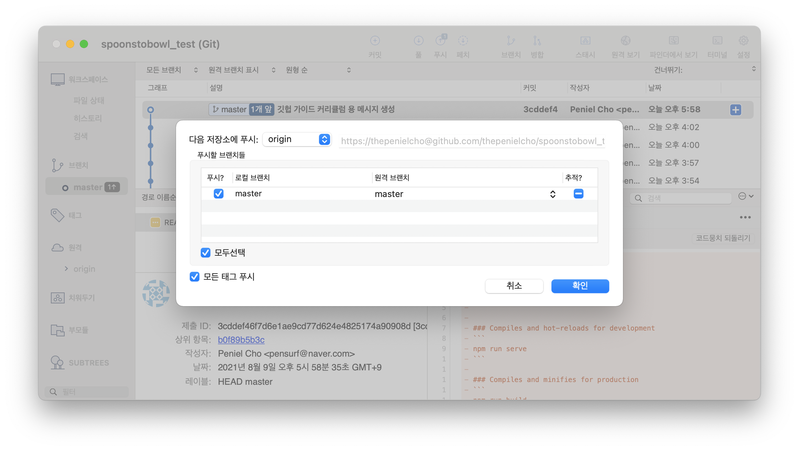
상단의 푸쉬 버튼을 누르면 위와 같은 화면이 나올 거에요. 다음 저장소에 푸쉬는 remote add할 때 정해준 레포지토리의 닉네임(보통 origin)을 선택해주면 되고, 브랜치는 디폴트 브랜치(보통 master)를 선택해주면 돼요. 확인을 누르면 git push도 성공입니다!
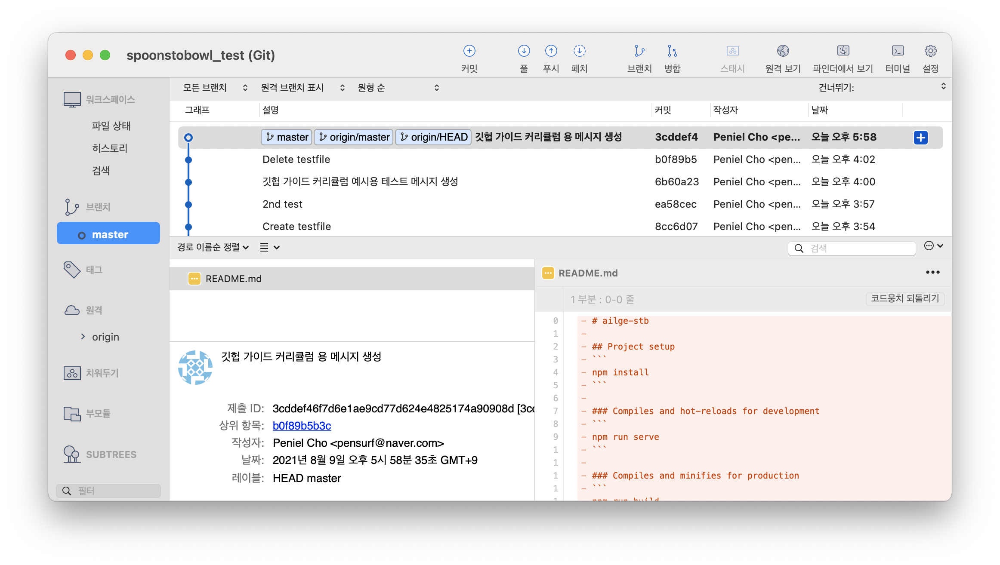
푸쉬를 마치게 되면 위와 같이 레포지토리 닉네임과 푸쉬 받은 브랜치명이 나타난답니다.

### git pull
온라인 레포지토리에서 변화가 생겼을 경우, 해당 변화를 받아오는 git pull을 해봅시다. 먼저 온라인 레포지토리에서 README를 수정했어요. SourceTree에서 pull을 눌러봅시다.
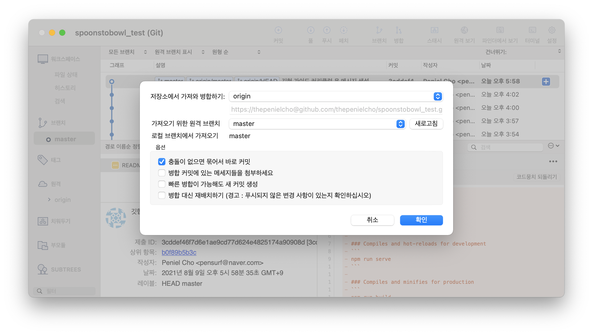
위와 같은 창이 뜨네요. 어떤 저장소와 브랜치에서 변화를 가져올지 물어보는데, push 때와 같게 레포지토리 닉네임과 디폴트 브랜치(보통 master)를 선택해주면 돼요. 아래 옵션 중에는 '충돌이 없으면 묶어서 바로 커밋'을 선택해줍시다. 내 로컬 폴더의 파일들과 병합시 에러를 발생시키지 않으면 그대로 병합을 진행한다는 뜻이에요.
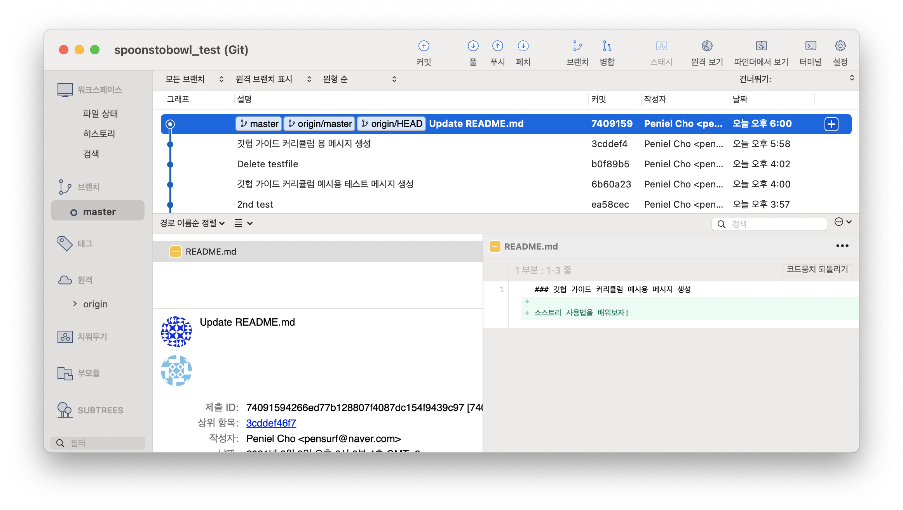
푸쉬를 마치면 위와 같이 온라인 레포지토리에서 만든 커밋 메시지와 로컬, 레포지토리의 브랜치명이 나타나요.

### git clone
이번엔 레포지토리를 로컬에 복사해와볼까요? 
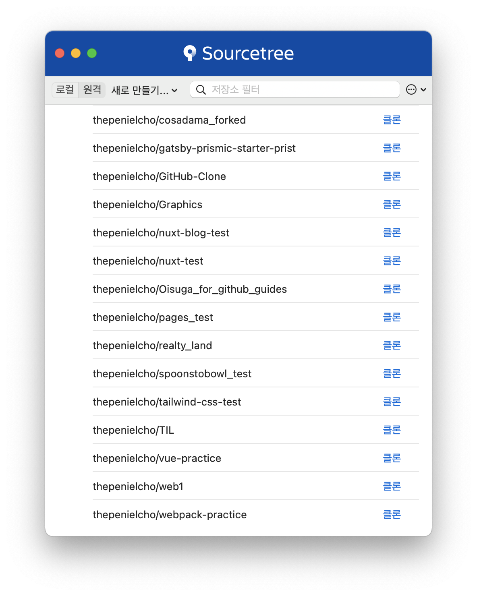
소스트리 앱 메인 화면에서 원격 탭을 눌러보면, 연결된 깃헙 계정의 레포지토리들이 주르륵 나와요. 이 중 클론하기 원하는 레포지토리를 골라 우측의 클론 버튼을 눌러줍니다. 
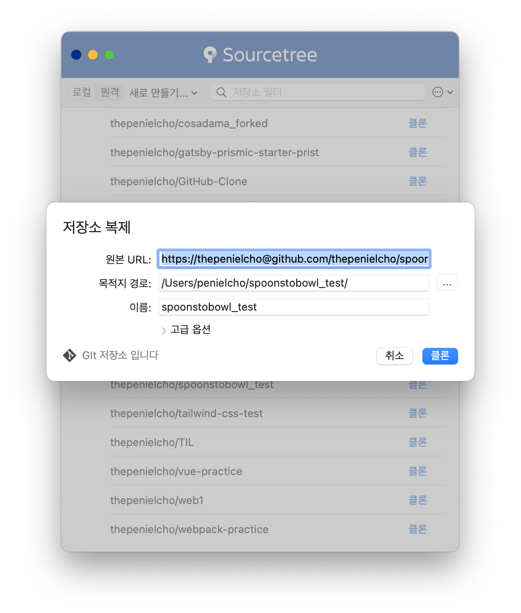
위와 같은 팝업창이 뜨는데, 목적지 경로만 원하는 디렉토리로 수정해줍니다. 이후 클론을 눌러주세요.
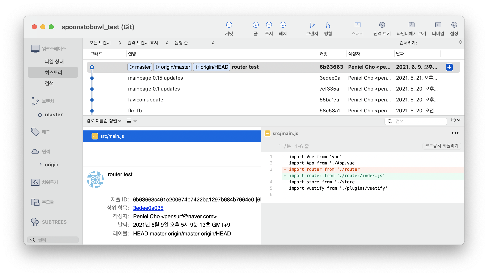
앞서 본 작업들이 가능한 레포지토리 관련 윈도우가 뜨면 클론 완료! 혹시 모르니 로컬 폴더에 파일들이 잘 클론 됐는지도 확인해봅시다.
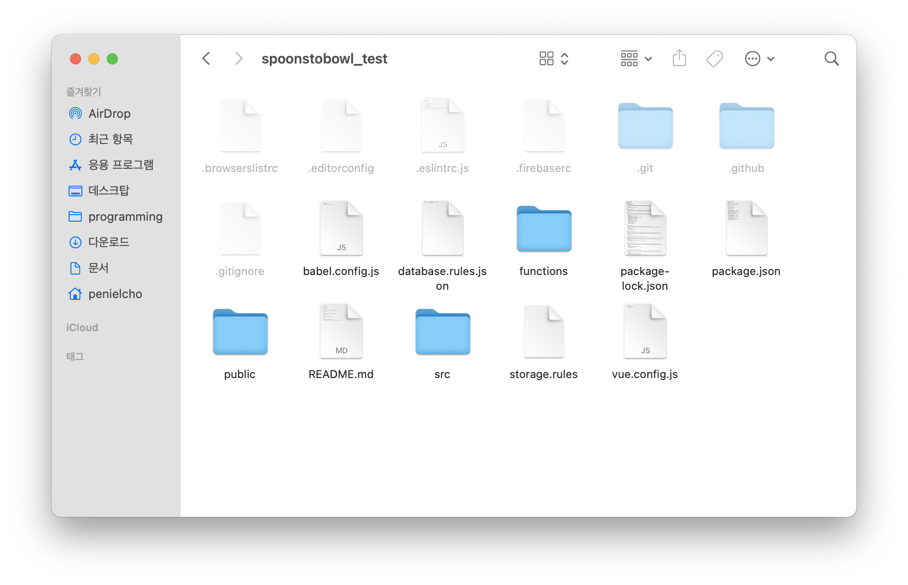
잘 되었네요!

## 유의점
CLI 명령어를 통한 git 작업보다 훨씬 쉽고 직관적이라는 인상을 받으셨을 텐데, 그렇다고 GUI만 사용하시면 안 돼요! CLI의 각 명령어와 관련 개념들이 손과 머리에 익었을 때부터 GUI를 사용해주세요. 계속 GUI만 사용하시면 이후 배울 git/github 심화 커리큘럼(런칭 일자 미정) 내용을 이해하기 힘들어집니다ㅠ